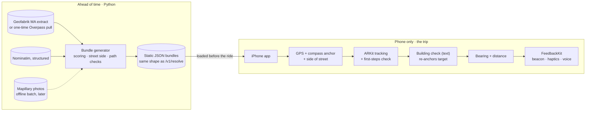
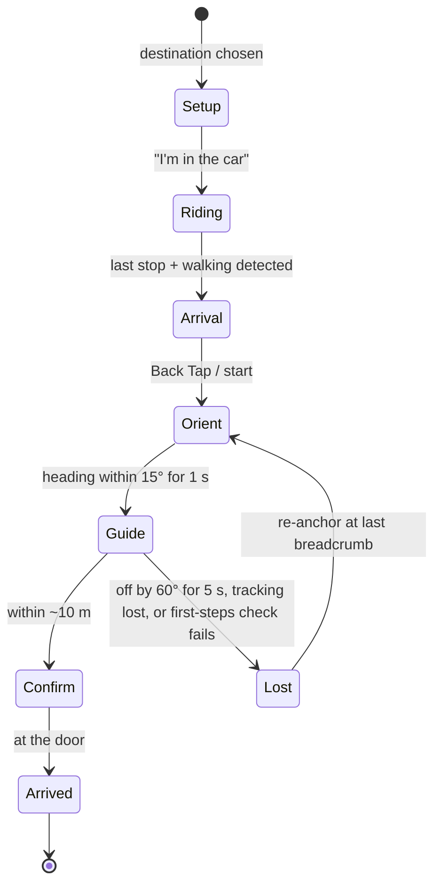

# Car to Curb: Build Plan and Architecture

**Team:** MIT Assistive Tech, Blind Assistance [Software], 2026–27
**Status:** Draft for team review. Every number and threshold here is a proposal until the team and the codesigners sign off.
**Last updated:** 2026-10-06

> **Architecture review (2026-10-06).** Four independent checks were run against current documentation, published research and live API calls:
> - iOS platform limits
> - data sources and server design
> - algorithms and CV accuracy
> - a system-level reality check of scope, risks, gaps and safety
>
> This version applies their fixes:
> - a tighter MVP
> - three spoken confidence states instead of noisy-OR scoring
> - the pinhole bearing formula for street photos
> - a new side-of-street method
> - honest positioning accuracy with re-anchoring
> - a 10–25 m building-check range
> - background-location and entry-flow design
> - more safety rules
> - evidence-based metrics
> - corrected data-source limits
> - a reordered roadmap
>
> Key sources are in [section 24](#24-sources).

---

## Contents

1. [Problem](#1-problem)
2. [MVP](#2-mvp)
3. [Full user workflow](#3-full-user-workflow)
4. [Architecture overview](#4-architecture-overview)
5. [Sensor handoff](#5-sensor-handoff)
6. [Side-of-street detection](#6-side-of-street-detection)
7. [Camera building check](#7-camera-building-check)
8. [Server: entrance resolution](#8-server-entrance-resolution)
9. [Reading OSM entrance tags](#9-reading-osm-entrance-tags)
10. [API contract](#10-api-contract)
11. [Phone: iOS app](#11-phone-ios-app)
12. [Routing](#12-routing)
13. [Computer vision and ML](#13-computer-vision-and-ml)
14. [Data sources and limits](#14-data-sources-and-limits)
15. [Integrations](#15-integrations)
16. [Security, privacy and safety](#16-security-privacy-and-safety)
17. [Failure handling](#17-failure-handling)
18. [Testing and field trials](#18-testing-and-field-trials)
19. [DevOps and team workflow](#19-devops-and-team-workflow)
20. [Work breakdown](#20-work-breakdown)
21. [Roadmap](#21-roadmap)
22. [Decision records](#22-decision-records)
23. [Open questions](#23-open-questions)
24. [Sources](#24-sources)

---

## 1. Problem

After an Uber, Lyft or Waymo drops off a blind or low-vision rider, existing apps (BlindSquare, VoiceVista, Waymo's "Find my destination") get them to within 30 ft–30 yd of a building's general location, not to the door. The last 10–40 m is still guesswork: which side of the street, which side of the building, which door is the entrance.

**What the codesigners told us:**
- **Dealbreakers:** reliability, speed, convenience ("is an existing tool easier?"), wearables that draw negative attention, short battery life, proprietary chargers.
- **Privacy:** they prefer AI that runs on the phone.
- **Feedback:** people differ, so support haptics, sound, voice and braille input, each switchable, and shareable presets. "Return to a known vector in the shortest period."
- **Test cases:** getting out of an Uber with the entrance on the same side, on the opposite side, near driveways, on a campus, at a hotel, and coming out of the subway.

**End goal:** one app covering Car to Curb (this plan), then Curb to Car, a Bus Stop helper, and Meta glasses integration.

---

## 2. MVP

**One sentence:** an iPhone app that guides a blind rider from a same-side drop-off to the entrance, using a precomputed entrance bundle, side-of-street detection, a 3D audio beacon with haptics and voice, and a camera building check that corrects the target. It always says how sure it is.

**Core value to prove:** a blind rider reaches the correct door on their own, faster and more reliably than with the tools they already use. If that fails, nothing else on the roadmap matters.

The review found the original MVP was about three times what the team can ship by April, with the critical path on the team's least familiar skill (Swift). This is the tighter **"Same-side Car to Curb"** MVP.

### In, by the April freeze
- **Precomputed entrance bundles for the pilot sites.** A Python script turns OSM data into JSON bundles for the golden sites plus a few dozen MIT and Kendall buildings. They're served as static files or shipped in the app. A live `/v1/resolve` for any address is a stretch goal.
- **Side of street from the car's course along the road,** with "unknown → ask" ([section 6](#6-side-of-street-detection)).
- **GPS and compass anchor, then a straight-line spatial beacon with voice distances,** using sidewalk and footway waypoints where OSM has them.
- **ARKit tracking in camera-first mode,** with breadcrumbs and "back to last breadcrumb" recovery.
- **A building check by text recognition that re-anchors the target,** not just raises confidence ([section 7](#7-camera-building-check)).
- **Spoken OSM door facts** (steps, door type, automatic door) and an honest end state: *"The door should be about 10 feet ahead. Feel for the handle."*
- **FeedbackKit with 3 channels** (beacon, haptics, voice), an on/off switch for each, 2 verbosity levels, and 2–3 built-in presets.
- **One working entry point:** the app opened with VoiceOver, plus one App Intent or Back Tap shortcut.
- **A trip logger and replay harness,** because everything else is measured with them.
- iOS only, iPhone 12 or newer. LiDAR helps but isn't required.

### Later (v1.5 / v2)
- **Custom door detector.** Benchmark iOS Magnifier Door Detection first (CV-11). If Magnifier works well on LiDAR phones, hand off to it for the last 5 m. The detector is a parallel, optional track.
- **Mapillary photo pipeline,** run as an offline batch when it comes back. Also later: background jobs and `202`, `GET /v1/destinations/{id}`, `/v1/flags`, crowd feedback, App Attest, Sentry and uptime alerts.
- **Valhalla routing.** Stadia's terms ban caching beyond 7 days, so self-host it or fetch routes at trip time.
- **Subway exits,** which move to the transit and Bus Stop track.
- **Extras:** `.bafeedback` import/export, the per-event routing matrix, a third verbosity level, the Action Button, Control Center controls, Depth Anything, LiDAR depth.
- **GeoTracking:** keep only a yes/no availability check for now.
- **Also v2:** Curb to Car, obstacle alerts, Apple Watch haptics, AirPods head tracking, rideshare deep links.

### v3+
Bus Stop helper · Meta Ray-Ban glasses (Wearables Device Access Toolkit is a developer preview) · Android · indoor navigation · street-crossing guidance · the "other ideas" list from the meeting notes.

### Not doing
- ML on Google Street View: Google's terms ban ML on Maps content and caching it.
- Telling users when it is safe to cross a street.
- Pointing the beacon across a street.

### Success metrics (proposed, to agree with the codesigners in November)

| Metric | Target |
|---|---|
| Reached the correct door, no sighted help, ≤ 3 min | ≥ 70% overall, ≥ 85% same-side at tagged sites |
| App named a wrong door with confidence | Reported as "0 in N" with its 95% bound (about 3/N) |
| Final position error | ≤ 3 m when the camera or building check confirmed; ≤ 8 m GPS/ARKit only |
| Time from Back Tap to hand on the door | median ≤ 1.5× a sighted walker |
| Head-to-head with their current tool | preferred in ≥ 2 of 3 scenario types |
| Battery per guided trip | ≤ 8% per 10 min |
| Recovery after going off course | median ≤ 20 s |

Report n and 95% confidence intervals with every number. Two codesigners at a few sites is qualitative evidence. If the numbers need to mean something, recruit 3–5 more blind participants through COUHES.

### Test scenarios

| Scenario | What's hard | April gate |
|---|---|---|
| Same side of street | Picking the neighbor's door | ≥ 85% (gates the freeze) |
| Near driveways | Curb cuts look like walkways; garage doors look like entrances | 0 driveway or garage errors (gates the freeze) |
| Opposite side | Needs a crossing | Supported only as *"Your entrance is across the street. I'll stop guiding until you're across."* Measured, not gating. |
| Campus (MIT) | Address doesn't match the door; many doors, some locked | Measured, not gating |
| Hotels | Drop-off lanes, revolving doors, lobby vs restaurant entrances | Measured, not gating |
| Coming out of the subway | No car heading, no GPS underground | Moved to the transit track |

---

## 3. Full user workflow

Example: a blind rider is going to a meeting at MIT Building 7, 77 Massachusetts Ave.

### 0. First-time setup (once)
- **Rider:** installs the app and opens it with VoiceOver. A spoken tour asks how they want guidance (they pick sound + vibration, short voice), which units (feet), and whether to set up Back Tap (yes). It also recommends open-ear or bone-conduction headphones, or one earbud, so traffic stays audible.
- **Behind the scenes:** the choices become their feedback profile, saved on the phone. There's no account. Location ("while using") and camera permission are each asked for the first time they're needed, with spoken reasons.

### 1. Setting the destination
- **Rider:** books the Uber as usual. Then they open the app and pick the destination from **saved places**, paste or share the address from the Uber app, or say *"Hey Siri, find my entrance"*. Siri then asks *"What address?"*, because Siri phrases can't contain a free-form address.
- **Behind the scenes:** the app loads the entrance bundle for that building. For the pilot this is a precomputed file. The bundle says Building 7's `entrance=main` node faces Mass Ave, tagged `automatic_door=button` and `step_count=3`. It also says Mass Ave is two-way and the door is on the right-hand side of the road's centerline direction. The phone keeps the bundle, so the walk needs no network.
- **Rider hears:** *"Map shows the main entrance for 77 Mass Ave, facing Mass Ave on the east side. It has 3 steps and a push-button door. Tap 'I'm in the car' when your ride starts."*

### 2. During the ride
- **Rider:** taps **"I'm in the car"** once.
- **Behind the scenes:** this starts background location while the app is in the foreground, so the blue location indicator shows. It also refreshes the bundle. The phone records the car's course along the road. There's no ETA announcement, because nothing in the system knows the ride's ETA.

### 3. The car stops: which side of the street?
- **Behind the scenes:** the phone sees the last stop followed by walking motion. Just before the stop, the car's course was moving the same way as the road's centerline. In the US, cars pull over to the right, so the curb is on the right. The door is on the right of the centerline, so it's the **same side**. See [section 6](#6-side-of-street-detection).
- **Rider hears:** *"Exit on the curb side."* (On Waymo: *"Exit on the side away from traffic."*)

### 4. Starting guidance
- **Rider:** double-taps the back of the phone (Back Tap).
- **Rider hears/feels:** a double buzz, then *"Starting. Stand still for a moment."*
- **Behind the scenes:** a GPS fix and compass heading set the starting point, and ARKit starts tracking. The phone knows this anchor can be 5–15 m and 10–20° off, so it will keep correcting it.

### 5. Facing the right way
- **Rider hears:** *"Your entrance should be on this side of the street, about 110 feet ahead and to your right."* A tone plays from that direction.
- **Rider:** turns until they feel the **lock buzz** and the tone centers.

### 6. Walking, with the first-steps check
- **Rider:** walks with their cane. The phone is held or on a chest mount (camera-first mode).
- **Rider hears:** a centered tone while on course, a tick every ~15 ft, and spoken distances at 60 ft and 30 ft.
- **First-steps check:** after about 5 m, the phone compares the actual walking direction with the expected sidewalk direction. If they're more than ~30° apart, it says *"I'm not sure of the direction. Stop for a moment."* It then re-aligns with the sidewalk.

### 7. Building check (about 10–25 m out)
- **Behind the scenes:** text recognition runs on the camera frames 2–3 times a second. It reads "77" in the direction where the building should be.
- **Rider hears:** *"I can see '77' ahead, slightly right. That looks like your building, on this side."*
- **Behind the scenes:** the phone moves the target to match the building it sees. This **re-anchors** the guidance, correcting most of the starting-point error.

### 8. Going off track
- **Rider:** drifts left around a planter.
- **Rider hears:** *"Off route. Turn until the tone centers."*
- **Behind the scenes:** they were more than 60° off for over 5 s, so the beacon points to their **last breadcrumb**.

### 9. Getting close
- **Rider hears:** *"The door should be about 10 feet ahead. 3 steps up, push-button opener on the right. Feel for the handle."* A rising tone plays.
- **Later version:** a door model, or a handoff to iOS Magnifier Door Detection, adds *"Door, slightly right"* when the camera sees a door where the map says.

### 10. At the door
- **Rider hears/feels:** a long buzz, *"The door should be right in front of you. Feel for the handle,"* then *"Was this the right door? Tap once for yes, twice for no."* They tap once.
- **Behind the scenes:** the outcome (reached the door, 1 min 40 s, 1 recovery) is saved on the phone only.

### The same trip when things go differently

| What happens | What the rider hears |
|---|---|
| The door is across the street | *"Your entrance is across the street. The nearest marked crossing is about 100 feet to your left. I'll stop guiding until you're across."* The beacon never points at the door across the street. |
| No tagged entrance | At setup: *"No door on the map. I'll guide you to the street-facing side of the building."* At the end: *"The door should be along this wall. Feel for it, or ask someone nearby."* |
| The camera reads "77" on the wrong building | *"I see '77', but it may not be your building."* |
| The first steps go the wrong way | *"I'm not sure of the direction. Stop for a moment."* |
| One-way street, or the clues disagree | *"I'm not sure which side of the street you're on. Are you on the sidewalk, with the building side to your right?"* |
| The app was closed during the ride | Side of street is unknown, so it asks, as above |
| Driveway ahead | *"Driveway ahead. Listen for cars."* The beacon pauses during the warning. |
| Phone goes in a pocket | The tone keeps playing, using GPS course. Vibration, ARKit and the camera pause. |
| Tracking lost, overheating, low battery | *"Guidance paused."* Guidance never stops silently. |
| Pause now | VoiceOver magic tap (two-finger double-tap) pauses and resumes. The on-screen Stop button or "Stop guiding" ends the trip. |

---

## 4. Architecture overview

Two halves meet once per trip: entrance data for buildings, and an iPhone app that knows about the user. For the MVP, the entrance data is a set of precomputed bundles. A live server is a stretch goal. Either way, nothing ever learns where the rider actually is, and the walk needs no signal.



| Part | Runs on | Built with | Job |
|---|---|---|---|
| Bundle generator | Laptop / CI | Python, Shapely, pyproj | OSM data → ranked doors, street side, path checks, landmarks |
| Entrance service (stretch) | Server | Python, FastAPI | The same output, live, for any address |
| iOS app | Phone | Swift / SwiftUI | Screens, entry points |
| NavigationSession | Phone | Swift state machine | Setup → Arrival → Orient → Guide → Confirm → Arrived / Lost |
| LocationKit + ARGuide | Phone | CoreLocation, Core Motion, ARKit | Positioning, side of street, re-anchoring |
| DoorVision | Phone | Vision (+ Core ML later) | Building check now; door detection later |
| FeedbackKit | Phone | Core Haptics, AVAudioEngine, speech | Plays events on the rider's chosen channels |

---

## 5. Sensor handoff

Each sensor hands off to a more precise one as the rider gets closer. The review corrected how precise each one really is.

| Distance to door | Leads | Real accuracy and notes |
|---|---|---|
| Curb → ~25 m | GPS + compass | GPS is 5–15 m off near buildings (with long tails beyond 30 m). The compass beside a car is ±10–20°, which is 7–14 m sideways at 40 m. This is the biggest error in the system. Works in a pocket. |
| ~25 → 10 m | ARKit + building check | ARKit tracks *relative* motion well, but drifts about 1–3 m over 50 m (measured at 6–7 cm per meter walked). It inherits the starting point's error, so it can guide precisely to the wrong spot unless the app re-anchors. |
| 10 → 0 m | Spoken door facts (door check later) | "About 10 feet, feel for the handle" in the MVP. A door model or Magnifier handoff comes later. |

**Re-anchoring (ADR 0011):**
1. **First-steps check:** after ~5 m, compare the walking direction with the expected sidewalk direction. If they're off by more than ~30°, say "I'm not sure" and re-align.
2. **Sidewalk alignment:** align the heading with the walking direction along the OSM sidewalk or footway.
3. **Building check:** when text recognition sees the building number in a known direction, move the target to match.

**iOS limits:**
- ARKit and the camera stop when the screen locks or the app goes to the background, and they won't recover after a walk.
- Core Haptics stops in the background.
- In a pocket, the compass heading isn't the rider's facing direction, so the app uses GPS course while walking.
- 3D audio only works on headphones. On the phone speaker, use a non-spatial cue such as pitch and pulse rate.
- ARKit GeoTracking needs a network connection, which conflicts with an offline walk. It's optional only.

---

## 6. Side-of-street detection

Before the car stops, nobody knows where the driver will pull over, so the app can only predict. Rider GPS can't decide it either: a street is 10–20 m across and GPS is often 5–15 m off. The car's course along the road is the stronger clue.

**How it decides (ADR 0009):**
1. **Ahead of time (bundle generator):** find the street the entrance faces, which isn't always the address street. Save the road's centerline as an ordered list of points and whether it's one-way. Using the exact geometry, compute `door_side_of_road`: `"left"` or `"right"` of the centerline's direction, from its first point to its last.
2. **Phone, as the car stops:** read the car's direction of travel from `CLLocation.course`. Use only readings with good `courseAccuracy` at speeds above 3 m/s, matched to the OSM road. Take the sign of `dot(course, road_direction)`:
   - **Same direction as the centerline** → US cars pull over to the right, so the curb is on the **right**.
   - **Opposite direction** → the curb is on the **left** of the centerline's direction.
3. **Compare:** same side if and only if the curb side equals `door_side_of_road`.
4. **Confirm on the curb:** the first-steps check and the building check.

The phone never uses the car's GPS *position* in a cross product. Near the curb that position is too noisy, and a small error flips the answer.

**Unknown (then ask) when:**
- the street is one-way, so the car may pull over on either side
- there was a turn or U-turn in the last 10 s
- the stop wasn't on the matched road (parking lot, driveway)
- course accuracy was poor
- the app was closed during the ride, so there's no track

**Worked example:**
- The centerline runs east, from its first point to its last.
- The door is south of it. Facing east, south is on your right, so `door_side_of_road = "right"`.
- **Car course 92°:** the dot product with the east-pointing road is positive, so the car moved the same way. The curb is on the right, the door is on the right → **same side**. *"Your entrance should be on this side of the street."*
- **Car course 268°:** the car moved opposite to the centerline, so the curb is on the left. The door is on the right → **across the street**. *"Your entrance is across the street. I'll stop guiding until you're across."*

**Why the "rider is at the curb" assumption needs care:**
- Ride-hail cars often stop in a travel lane. The SF Curb Study found 25–75% of downtown pickups and drop-offs happened in a lane.
- A rider in the back seat can open the street-side door.
- So the app always says **"Exit on the curb side"** at drop-off, and on Waymo, "the side away from traffic".
- No published dataset covers this, so log it in every trial: final car course, matched road, curb or lane stop, and the side the rider exited.

| Situation | Problem | Handling |
|---|---|---|
| One-way street | The car can pull over on the left | Side unknown → ask |
| Turned just before stopping | Course points the wrong way | Unknown if there was a turn in the last 10 s |
| Double-parked or stopped in a lane | The rider may not be at a curb | "Exit on the curb side" prompt, then the first-steps check |
| Corner building | The door faces a different street | Use the entrance's street, not the address street |
| Bike lane between car and curb | The rider crosses it first | Warn when OSM marks `cycleway=lane/track` on the curb side |
| Wide avenue with a median | Crossing is harder | Stronger warning, point to the nearest marked crossing |

Before arrival, the app says which street and side the door is on ("faces Mass Ave, east side"), never "your side".

---

## 7. Camera building check

In camera-first mode, from about 10–25 m out, the camera confirms "this looks like your building" and corrects the target. ARKit already uses the camera, so reading the same frames costs little.

**Realistic range** (iOS review, from camera resolution, field of view and Vision's minimum text height):

| Setup | Range for 15–30 cm house numbers |
|---|---|
| Standard ARKit frames (1920×1440) | about 10–20 m |
| High-res stills (`captureHighResolutionFrame` or the 4K format) plus a cropped region and a lower `minimumTextHeight` | about 20–35 m |
| Large building signs | up to ~50 m |

| Option | Phase | How |
|---|---|---|
| **Read the signs** | MVP | Apple Vision's text recognition, on the phone. Reads the street number, building name and signs, matched against `addr:housenumber`, `name` and tenants in the bundle. Only counts if the text's direction points at the expected building outline. When it matches, the target moves to fit the building it sees. |
| **ARKit GeoTracking** | Optional | Matches the view against Apple's street imagery. Needs network, supported cities only. Check each test site with `checkAvailability(at:)`. |
| **Facade matching** | v2 | Match live frames against saved Mapillary photos of the destination's front. Research-level ML work. |

**Implementation notes:**
- Pass the correct image orientation (`.right` for a portrait iPhone), or text recognition fails.
- Run requests one at a time on a background queue, skipping frames while busy, and never hold on to `ARFrame`s.
- In low light, use ARKit's light estimate to say *"Camera check unavailable in low light"* rather than failing silently.

| Concern | Handling |
|---|---|
| Holding the phone up (tiring, draws attention) | Recommend a chest mount. Ask the codesigners early (risk R2). |
| Battery | 2–3 checks a second, stopping once the building is confirmed |
| Pocket mode | Profile setting: **camera-first** or **pocket mode** |
| Bystanders in frame | Frames never leave the phone; nothing is stored |
| "77" on the wrong building | Doesn't count unless the direction matches. Otherwise: *"I see '77', but it may not be your building."* |

Wording: *"That looks like your building."* Never "That's your building."

---

## 8. Server: entrance resolution

For the MVP, this runs as an **offline bundle generator**: a Python script over the pilot area that writes one JSON bundle per destination, in the same shape as `/v1/resolve` (ADR 0012). The same code can later run behind a live FastAPI endpoint.

### The lookup ladder
1. **Geocode** with Nominatim using a **structured query** (`street`, `city`, `state`, with `layer=address&entrances=1`). Free-form "77 Massachusetts Ave, Cambridge, MA" returned a bus stop named after the address. Limit calls to 1 request/s for the whole process and send an identifying User-Agent. Nominatim's `entrances` list includes exits, so apply the same exclusions.
2. **Find the building:** from the pilot-area data, the outline containing the point (point-in-polygon in Shapely), else one matching the house number within 30 m, else the nearest. Include multipolygon outer members and `building:part` ways.
3. **Read entrance nodes** on the outline: `entrance=*`, `door=*` and `routing:entrance`, plus site-relation members with role `entrance`. Split combined values on `;` and apply the exclusions ([section 9](#9-reading-osm-entrance-tags)). **Stop only if a candidate reaches the `main` band.** Don't stop at `entrance=yes`.
4. **Street photos (later, offline batch):** see below.
5. **Geometry fallback:** the middle of the street-facing side, then the address point.

Then merge candidates within ~4 m. Add the path checks, street side, landmarks and text to recognize, and keep the top 5.

### Scoring: three spoken states (ADR 0014)
An ordered rule list produces a number used **only for ranking**, and three spoken bands. The review found noisy-OR invalid: OSM entrances are often traced from the same street photos, so the sources aren't independent, and with no calibration data the decimals are false precision.

| Rule (in order) | Score | Band |
|---|---|---|
| Excluded value or access ([section 9](#9-reading-osm-entrance-tags)) | never used | — |
| Entrance node's `addr:housenumber` = destination number | 0.95 (ranked first) | `main` |
| `routing:entrance=*` or site-relation role `entrance` | 0.90 | `main` |
| `entrance=main` | 0.90 | `main` |
| `staircase` / `home` for a residential address · `shop` when it's the destination | 0.85 | `main` |
| `entrance=yes` / `entrance` / `door=*` only | 0.75 | `door` |
| Street photos, 2+ sequences agree | 0.65 | `door` |
| `secondary` | 0.60 | `door` |
| Unknown value · `shop` that isn't the destination | 0.50 | `door` |
| Street photos, single sequence | 0.45 | `door` |
| Street-facing side | 0.30 | `facade` |
| Address point · `service` (last resort, with a spoken warning) | 0.20 | `facade` |

**Small adjustments:**
- `wheelchair=yes` +0.05, `wheelchair=no` −0.05.
- A footway attached to the node +0.05.
- Found within 5 m but not on the outline −0.10.
- `opening_hours` says closed now −0.30.

**Combining:** take the **best score among independent evidence classes**, plus one step (+0.05) when 2 or more classes agree within ~8 m, capped at **0.95**.
- The classes are OSM tag, street photos, and rider confirmations (later).
- An OSM node traced from street photos counts as the same class as street photos.
- Nothing is certain without confirmation on the spot.

**Bands:** ≥ 0.85 → `main`, ≥ 0.45 → `door`, else `facade`. Calibrate each band's real precision in the October audit. Several `main` doors are tie-broken by walking distance from the expected drop-off.

### What the rider hears

| Band | Spoken |
|---|---|
| `main` | "Map shows the main entrance, about 110 feet ahead, slightly right." |
| `door` | "Map shows a door here, about 110 feet ahead. It may not be the main entrance." |
| `facade` | "No door on the map. Guiding you to the street-facing side." |
| Camera sees a door that matches (only once a door model ships) | "Door, slightly right." |

### Path checks (in the bundle)
- **Road crossing:** does the straight line cross a road (`highway=*` that isn't a footway, `service=driveway`, or a parking aisle)? If so, point to the nearest marked `footway=crossing`, and the beacon never points across.
- **Driveways and parking aisles:** these are a separate warning class (*"Driveway ahead. Listen for cars."*), not road crossings.
- **Through the building:** does the line pass through the building? If so, go around the nearest corner.
- **Off the sidewalk:** does the line leave the sidewalk across a plaza, parking lot, lawn or drop-off lane? If so, follow footway geometry. If there's none, say *"I don't have a safe path. Follow the sidewalk."*
- **Footway to the door:** does a footway reach the entrance node? Then use it for the last meters.

### Finding a door from street photos (later, offline batch)

When OSM has no door, a batch job over the pilot area can locate one from public Mapillary photos. It runs on a laptop or Colab, not on a $4 server. Each photo records where the camera stood and which way it pointed. A door found in the photo becomes a direction, and a line from the camera in that direction hits the building wall at the door.

1. **Get photos facing the building:** within 50 m, keeping photos pointing within about **±35–40°** of the wall.
2. **Find doors** in each photo. Start from the open model and data of Mapillary's 2026 entrance-detection project.
3. **Turn the pixel into a direction with the pinhole model:**
   `offset = atan((2x / w − 1) · tan(FOV / 2))`, `bearing = compass_angle + offset`.
   FOV comes from Mapillary's `camera_parameters` (normalized focal length) and `camera_type`. Spherical images are handled separately. The old linear formula `(x/w − 0.5) × FOV` is wrong for normal photos.
4. **Triangulate rays with each other,** then snap the result to the building outline (Shapely).
5. **Combine photos:** cluster with DBSCAN at ~4 m, the measured error. Require 2+ separate photo sequences for the 0.65 score.
6. **Convert back to lat/lon** (pyproj). Store Mapillary image IDs, not thumbnail URLs.

**Worked example** (local meters, x = east, y = north, front wall along x = 20, FOV 60°, photos 1,000 px wide):

| | Photo A | Photo B |
|---|---|---|
| Camera position | (0, 0) | (10, −30) |
| Compass angle | 90° | 30° |
| Door box center x | 700 px | 350 px |
| `2x/w − 1` | +0.4 | −0.3 |
| Offset `atan(… × tan 30°)` | +13.0° | −9.8° |
| Bearing to door | 103.0° | 20.2° |
| Line hits wall at | (20, −4.6) | (20, −2.8) |

The two hits are **1.8 m apart**, so they form one candidate at **(20, −3.7)**, band `door`. The old linear formula put them 0.4 m apart, which looked more precise than it is.

**Expected accuracy:** the closest published pipeline (Mapillary, 2026) reached precision 0.83, recall 0.62 and 4.26 m mean error. The causes add up:
- Compass error (5° is about 1.7 m at 20 m).
- Photo position error.
- OSM outlines that are 3–4 m off on average in published studies.
- Old photos, and garage doors mistaken for entrances.

**Targets:** median ≤ 4 m and 90th percentile ≤ 8 m. These candidates are only spoken as `door`, never `main`.

### Data model (when a live server returns)
```
buildings(id, osm_id UNIQUE, polygon_geojson, polygon_hash, street_side_json, fetched_at)
destinations(id, building_id, address_hash UNIQUE, created_at)        -- no install key, no raw address
candidates(id, building_id, lat, lon, source, score, band, provenance_json, created_at)
```
- Key the cache by `building_id` plus an address hash.
- Never store an install key or raw address text with destinations. Together they amount to a trip history that reveals home addresses.
- Entrances are added to OSM only by hand, from a survey.

### Caching and precompute
- **Pilot area:** load OSM data once from the Geofabrik Massachusetts extract, or a single Overpass pull for the area's bounding box. Re-run it monthly.
- **Bundles:** regenerate when OSM data or scoring rules change. The app refreshes its bundle when the rider taps "I'm in the car".
- **Live server (stretch):** `/v1/resolve` answers from the cache only, within ~3 s, and never calls slow outside services in the request path.

---

## 9. Reading OSM entrance tags

From the OSM wiki ([Key:entrance](https://wiki.openstreetmap.org/wiki/Key:entrance), Tag:entrance=main, Key:door, Key:automatic_door) and Taginfo. There are 5.46M `entrance=*` tags worldwide, almost all on nodes.

**Local coverage is low** (live Overpass counts, 2026-10-06):

| Area | Buildings with at least one entrance node |
|---|---|
| MIT / Kendall | about 10% (57 of 553) |
| Cambridge | 1.8% (261 of 14,618) |
| Massachusetts | under 0.3% (7,790 entrance nodes vs 2.68M buildings) |

So the street-facing fallback is the normal path almost everywhere. The cheapest fix is to **survey the pilot sites and add their entrances to OSM** early (task MAP-1). Every system that solved the last meters for blind travelers relied on a pre-verified map of the target area.

| Value | Meaning | Uses | Treatment |
|---|---|---|---|
| `yes` | Generic way in or out | 3.03M | 0.75, `door` |
| `main` | Main entrance; a building can have several | 1.02M | 0.90, `main` |
| `staircase` | Door to a staircase (apartment blocks, often has the address) | 723k | 0.85 for a residential address, else 0.50 |
| `home` | Door of a private house or apartment | 292k | 0.85 for a residential address |
| `garage` | Garage door | 164k | **Exclude** |
| `service` | Staff or delivery door | 78k | 0.20, last resort, with a warning |
| `shop` | Direct shop door that isn't the main one | 65k | 0.85 if that shop is the destination, else 0.50 |
| `emergency` | Fire exit | 29k | **Exclude**; never guide here |
| `secondary` | Extra entrance, often only at special times | 27k | 0.60, "side entrance" |
| `exit` | Exit only | 16k | **Exclude** |
| `no` | A door exists but can't be used | 3k | **Exclude** |
| `entrance` | Entry only | 2.5k | 0.75 |

Also exclude `parking`, `loading_dock` and `basement`, and any `access`/`foot` set to `private`, `no` or `delivery`. Split combined values (`main;garage`, `garage;exit`) on `;` and use the best usable part. Ignore `railway=subway_entrance`, `indoor=door`, `barrier=entrance` and `barrier=gate`. These rules live in Python, in one tested place, not in the query.

**Tags to say aloud** (each is on only 0.3–6% of entrances, so every message must work without them):
- `automatic_door`: the wiki says it exists partly to warn blind users. Motion, button and continuous each get their own phrase.
- `door`: hinged, sliding or revolving ("Revolving door; use the side door if there is one").
- `wheelchair` as a stand-in for step-free, and `step_count` ("3 steps at the door").
- `level` ≠ 0 ("this entrance is on level 2").
- `name` and `ref` tell entrances apart. `entrance:ref` has 6 uses worldwide, so ignore it.
- `opening_hours` when it says closed now.

**Corrected Overpass query** (tested live 2026-10-06: 200 OK, 69 KB, 8.3 s). `{LAT}`/`{LON}` are the geocoded point:
```
[out:json][timeout:25];
// 1. Buildings near the point; choose the containing one in Shapely
(
  way(around:40,{LAT},{LON})[building];
  rel(around:40,{LAT},{LON})[building][type=multipolygon];
  way(around:40,{LAT},{LON})["building:part"];
)->.bld;
.bld out geom;
// 2. Outlines = building ways + outer members of multipolygon buildings
(way.bld; way(r.bld:"outer");)->.outlines;
// 3. Every door-like node ON an outline (filter values in Python)
(
  node(w.outlines)[entrance];
  node(w.outlines)[door];
  node(w.outlines)["routing:entrance"];
)->.ent;
// 4. Site relations: role=entrance marks preferred entrances
rel(bw.outlines)[type=site]->.site;
(.ent; node(r.site:"entrance");)->.ent;
.ent out body;
.site out body;
// 5. Footways that share an entrance node (last-meters path)
way(bn.ent)[highway~"^(footway|path|pedestrian|steps|corridor)$"];
out tags geom;
// 6. Roads and driveways near the building, for path checks and street side
way(around.outlines:60)[highway~"^(motorway|trunk|primary|secondary|tertiary|unclassified|residential|living_street|service)(_link)?$"];
out tags geom;
```

**Try it:** the endpoint is `https://overpass-api.de/api/interpreter`, not the homepage. Send an identifying User-Agent with a team contact. Paste the query into [overpass-turbo.eu](https://overpass-turbo.eu) to see it on a map. Use this for exploring and the one-time pilot pull only, not on every request ([section 14](#14-data-sources-and-limits)).

**Adding entrances to OSM:**
- Only from an on-site survey.
- Put the node on the building outline, add `door`, `automatic_door`, `wheelchair` and `step_count`, and join it to the sidewalk footway.
- Write changeset comments like "Add main entrance and door type to Building 7 based on survey".
- Keep every edit manual; automated edits are discouraged. Check whether OSM's Organised Editing guidelines apply to a class team before a mapping session.

---

## 10. API contract

The source of truth is `contract/resolve.example.json`. The MVP's static bundles use exactly this shape. A live `/v1/resolve` (stretch) returns the same JSON. A contract test keeps the example, the server models and the app's bundled copy in sync. This section describes the fields; it doesn't repeat the example.

| Endpoint | Phase | Purpose | Responses |
|---|---|---|---|
| Static bundle file per destination | MVP | Precomputed result | — |
| `POST /v1/resolve` | Stretch | Resolve an address or lat/lon from the cache, within ~3 s | `200` with `status: "complete"` or `"partial"` |
| `GET /v1/health` | Stretch | Liveness, data and model versions | `200` |
| `GET /v1/destinations/{id}`, `/v1/flags`, feedback | Later | Re-fetch, remote switches, rider confirmations | — |

There's no `202` and no polling. A weak result comes back as `200` with `status: "partial"`, so the rider always has something.

**Key fields:**

| Field | Values / meaning |
|---|---|
| `status` | `"complete"` or `"partial"` (a weak result, e.g. facade only; may improve later) |
| `candidates[].band` | `"main"`, `"door"` or `"facade"`, the three spoken states. No band is called "found". |
| `candidates[].confidence` | 0–0.95, for ranking only; never spoken as a number |
| `candidates[].speak` | Door facts to say aloud (`door`, `automatic_door`, `step_count`), each optional |
| `candidates[].provenance` | `source`: `osm_tag`, `mapillary_cv`, `crowd` or `geometry_fallback`, plus refs |
| `street_side.door_side_of_road` | `"left"` or `"right"`, relative to the centerline's direction (first → last point) |
| `street_side.centerline`, `oneway`, `entrance_street` | Inputs for side-of-street detection |
| `path_checks` | `crosses_road`, `nearest_crossing`, `footway_to_entrance` |
| `recognize.text` | Strings the building check looks for, e.g. `"77"`, the building name |
| `landmarks` | 2–3 fixed objects along the path, with side and distance to the door |
| `route` | Walking waypoints, or `null` for straight-line guidance |
| `attribution` | Must be shown in the app's About screen |

**Errors** all use one envelope: `{ "error": { "code": "...", "message": "...", "request_id": "..." } }`, including FastAPI's own validation errors.

| Code | HTTP | Meaning |
|---|---|---|
| `GEOCODE_NOT_FOUND` | 404 | Address not found |
| `NOT_FOUND` | 404 | Unknown resource |
| `UPSTREAM_UNAVAILABLE` | 503 | Data not ready and no cached result |
| `RATE_LIMITED` | 429 | Includes a `Retry-After` header |
| `VALIDATION` | 422 | Bad input |

Rate limiting, if the live server returns, is per IP and held in memory. Install keys are never stored with destinations.

---

## 11. Phone: iOS app

Native Swift / SwiftUI, **iPhone only**. The app logic never plays sounds or vibrations itself. It emits events, and FeedbackKit plays them on the rider's chosen channels. The starter project is in `app/` (see `app/Docs/Instructions.md`).



### Background location and relaunch (ADR 0013)
- Permission is **When In Use** only; no geofences, which need Always.
- Tapping **"I'm in the car"** while the app is in the foreground starts `CLBackgroundActivitySession` or `allowsBackgroundLocationUpdates`, plus `CLServiceSession` on iOS 18. The blue location indicator stays on for the ride.
- `UIBackgroundModes` must include **`location`** and **`audio`**. Turning on background location without the `location` key crashes the app.
- **Stop detection:** the last stop followed by Core Motion reporting "walking". A red light isn't a drop-off.
- **Relaunch:** the bundle and session state are saved on the phone. If the app was closed during the ride, there's no car track, so the side of street is unknown and the app asks.

### Entry points
- The app opened with VoiceOver: saved places first, plus search, dictation and braille through a standard text field, and paste or share from the Uber app.
- A **"Find my entrance" App Shortcut**, with saved places as App Intent entities, then a *"What address?"* prompt. Siri phrases can't contain a free-form address. Intents that start guidance bring the app to the foreground.
- Back Tap mapped to that shortcut.
- Later: Control Center controls (iOS 18) and the Action Button (iPhone 15 Pro and newer).

### Gestures (no conflicts)
| Gesture | Does |
|---|---|
| Back Tap | Start guidance; during a session, "repeat / where am I". It never stops guidance. |
| VoiceOver magic tap (two-finger double-tap) | Pause / resume guidance |
| On-screen Stop button, or the "Stop guiding" intent | End the trip |

### Modules
| Module | Apple frameworks | Job |
|---|---|---|
| App | SwiftUI, App Intents | VoiceOver-first screens and entry points |
| Session | Observation, Swift Concurrency | The state machine above |
| EntranceAPI | Codable, SwiftData / files | Bundle loading and cache; live client later |
| LocationKit | CoreLocation, Core Motion | GPS, course, heading, stop and walking detection, side of street, geometry |
| ARGuide | ARKit | Anchors GPS in AR space, tracks motion, breadcrumbs, re-anchoring |
| DoorVision | Vision (+ Core ML later) | Building check now; door detection later |
| FeedbackKit | Core Haptics, AVAudioEngine HRTF, AVSpeechSynthesizer | Events → channels per profile |
| Telemetry | OSLog | Trip log on the phone only |

**Concurrency:**
- Camera and perception run on one serial background queue, skipping frames while busy.
- Only UI updates use the main actor. The starter project's default main-actor isolation must not cover the camera, the perception pipeline or the data types.
- ARKit frames are YCbCr, not BGRA. Never hold on to `ARFrame`s.

### Screens
1. Destination: saved places, search, paste from Uber.
2. Saved places, with a stored door correction when the rider confirms one.
3. Settings: a switch for each channel, 2 verbosity levels, camera-first or pocket mode, 2–3 presets.
4. Active session: a full-screen "Where am I / Repeat" button and a Stop button.
5. After the trip: "Was this the right door?"
6. About: OSM and Mapillary attribution (logo plus link).

### FeedbackKit
Events: `direction(offsetDegrees)`, `distance(meters)`, `bearingLock`, `landmark`, `buildingConfirmed`, `doorDetected` (later), `warning`, `lost`, `arrival`. There is no free-text event; every spoken phrase comes from a reviewed phrase table, so the certainty-word test can check them all.

| Channel | How | Notes |
|---|---|---|
| Spatial beacon | `AVAudioEnvironmentNode` HRTF; listener orientation updated 30–60 times a second | Works with the screen locked (the `audio` background mode). Direction only comes through on headphones; on the speaker, use pitch and pulse rate instead. Volume is capped, and the beacon ducks during road and driveway warnings. |
| Haptics | Core Haptics patterns: direction tick, lock, distance pulse, arrival, warning | Stops in the background. The Apple Watch is the backup (v2). |
| Voice | `AVSpeechSynthesizer` with the user's VoiceOver voice | Queued behind VoiceOver; 2 verbosity levels |
| Braille | Braille screen input and displays via VoiceOver on standard text fields | Every input is a real text field or accessibility action |

**Audio session:** `.playback` / `.spokenAudio`, ducking other audio during speech and mixing with it for the beacon, so music and the Uber app keep playing. Handle interruptions such as phone calls.

### Accessibility checklist
- Every control has a label, a hint and the right trait. The session view has 7 elements or fewer.
- Dynamic Type up to AX5. Bold Text, Increase Contrast and Smart Invert are respected.
- No time limits, no long-press timers, no swipe-only controls.
- Audio tested alongside VoiceOver, Music, an active Uber trip and an incoming call.
- Critical events go out on at least 2 channels by default.

### Battery
- During the ride: background location only, with the rider's knowledge (blue indicator).
- Camera: building check in camera-first mode only, 2–3 times a second, stopping once confirmed. Models slow down when the phone runs hot.
- Use a 30 fps ARKit video format, and measure in the field with MetricKit.
- Target: ≤ 8% per 10-minute trip. The review estimated 2–3.5%, but it hasn't been measured.
- Below 15% battery at the start of a trip, warn the rider.

---

## 12. Routing

| Case | Approach |
|---|---|
| Same-side drop-off (MVP) | Straight-line bearing, using footway or sidewalk waypoints where OSM has them, plus the path checks |
| Opposite side (MVP) | No route. *"Your entrance is across the street. The nearest marked crossing is N feet to your left. I'll stop guiding until you're across."* The beacon stays silent or points along the sidewalk to the crossing, never at the door. |
| Campus, hotel, opposite side with guidance (later) | Valhalla pedestrian routes |

**Valhalla (later), from its route API reference:**

| Pedestrian option | What it does | Our use |
|---|---|---|
| `type: "blind"` | "Announcing crossed streets, the stairs, bridges, tunnels, gates and bollards… information about traffic signals on crosswalks" | Spoken route notes |
| `driveway_factor` | Multiplies the cost of driveways | Driveway scenario |
| `walkway_factor`, `sidewalk_factor` | Change the cost of footways and roads with sidewalks | Prefer real sidewalks |
| `step_penalty` | Seconds added for each move onto steps | Avoid stairs when possible |
| `preferred_side`, `street_side_tolerance` | Approach a location from the same, opposite or either side of the road | Opposite-side case |

Valhalla is open source (MIT license). Stadia Maps' hosted version lists `blind` in its API schema, and its free tier is non-commercial with about 10k routes a month. **Its terms ban server-side caching beyond 7 days**, so routes can't sit in long-lived bundles. Either fetch routes at trip time, or self-host Valhalla from the Massachusetts extract. Pass the entrance node's coordinates as the end point.

---

## 13. Computer vision and ML

Order of trust: a surveyed OSM door, then other OSM tags, then the building outline, then street photos. The camera on the phone never decides *which* door is the entrance. It only confirms that a building or door is where the map says.

### Camera jobs
1. **Building check (phone, MVP, ~10–25 m):** Vision text recognition, used to re-anchor the target ([section 7](#7-camera-building-check)).
2. **Door check (phone, later, optional parallel track):**
   - First benchmark iOS Magnifier Door Detection at the test sites (CV-11). If it works well on LiDAR phones, hand off to it for the last 5 m.
   - Otherwise, use a Core ML detector on ARKit frames, at most 10 per second off the main thread. It answers "is there a door here?", and the map decides which.
3. **Street photos (server, later, offline batch):** see [section 8](#8-server-entrance-resolution). Pinhole bearings, triangulation, ~4 m clustering, 2+ sequences.

### Models and licenses
| Need | Pick | License |
|---|---|---|
| Text | Apple Vision text recognition | Built into iOS |
| Phone door detector (later) | RF-DETR Nano/Small, or Create ML as an easy start | Apache-2.0 |
| Street-photo detector (later) | Start from Mapillary's 2026 entrance-detection model and data; RT-DETR / D-FINE | Check each license |
| Depth (later) | LiDAR `sceneDepth`, Depth Anything V2 **Small** | Small is Apache-2.0; Base and Large are non-commercial |
| Training data | Open Images V7 "Door", plus our own labeled campus frames | CC BY. Mapillary Vistas is non-commercial. |
| Benchmark to beat | iOS Magnifier Door Detection (no public API) | — |

### The YOLO license question (ADR 0007)
Ultralytics YOLO is **AGPL-3.0**. Anything you build with it and give to other people, including over TestFlight, must be released as open source under the AGPL. That covers the whole app, and Ultralytics says it covers trained models too. The AGPL also covers code run over a network. Separately, the GPL family has a known conflict with Apple's App Store terms. Apache-2.0 models (RF-DETR, RT-DETR, D-FINE) can be used in any app, open or closed, as long as you keep the notice.

**Recommendation:** prototype with YOLO if it's easiest, and switch to an Apache-2.0 model before the first TestFlight build. Alternatively, the team deliberately makes the whole repo AGPL. This is not legal advice; ask MIT's Technology Licensing Office if a product or partnership is ever likely.

### Evaluation targets (evidence-based)
- Split data by **location**, never by frame.
- **Door present** (per approach to a door): precision ≥ 0.90, recall ≥ 0.80 to ship. The best published outdoor result is 0.83 / 0.62, so this is already ambitious. Raise the bar later.
- **Street-photo entrances:** median error ≤ 4 m, 90th percentile ≤ 8 m, and only ever spoken as `door`.
- **Building check:** building and side right ≥ 90% at the golden sites.
- Below the bar, the feature ships switched off.

### v2: passive watching
A 2–4 fps obstacle detector plus a depth check of the path ahead, with a memory so each object is announced once. A VLM is used only on request, on the phone where possible, and any cloud use is opt-in.

---

## 14. Data sources and limits

| Source | Gives us | Limit / license (checked 2026-10-06) | Status |
|---|---|---|---|
| Overpass (public) | Buildings, entrances, footways, roads | The wiki says to "divide those numbers by 100" for anything that uses the API regularly. That's about **100 queries and 10 MB per day per deployment**, roughly 140 building lookups. Live checks also showed 2 slots per IP. Identifying User-Agent required; commercial use must self-host. ODbL. | Exploration and one-time pilot pull only |
| Geofabrik Massachusetts extract | All OSM data for the state, loaded ourselves | ODbL | **MVP data source** |
| Nominatim (public) | Address → point; `entrances` for buildings mapped as ways (v5.2+) | 1 request/s, identifying User-Agent, caching required; the operators can block heavy use. Use structured queries with `layer=address`. | MVP, behind the bundle generator |
| Apple geocoder / MapKit | Address search on the phone | Needs a network connection; results can't be stored on a server | Destination entry |
| Mapillary API v4 | Street photos with position, compass angle, `camera_parameters` | Free, CC-BY-SA 4.0, 50 m search radius, no door class. Attribution is the Mapillary logo plus a link. Store image IDs. | Later, offline batch |
| Valhalla / Stadia Maps | Pedestrian routes with blind-user notes | MIT license; Stadia free tier is non-commercial and bans caching beyond 7 days | Later |
| Apple Look Around (via GeoTracking) | Visual positioning | Supported cities only; needs a network connection | Optional |
| Google Street View | Better photo coverage | Paid; terms ban ML on Maps content and caching it | **Not used** |

**Licensing:**
- Merging OSM, Mapillary-derived and crowd entrances into one candidates table makes an **ODbL derivative database**, so be ready to publish it.
- Show OSM attribution and the Mapillary logo plus link on an About screen.

---

## 15. Integrations

| Integration | Gives | Phase | Risk |
|---|---|---|---|
| Geofabrik extract / Overpass | Outlines, entrances, footways, roads | MVP (precomputed) | Low entrance coverage; usage limits |
| Nominatim (structured) | Geocoding | MVP | Free-form queries can match POIs instead of the building |
| MapKit / CLGeocoder | Address search | MVP | Needs a network connection |
| ARKit world tracking | Relative motion | MVP | Stops when the screen locks; inherits starting-point error |
| CoreLocation course and heading | Car direction, rider heading | MVP | Magnetic interference near cars |
| Vision text recognition | Building check | MVP | Range 10–25 m; low light |
| App Intents / Back Tap | Start without the screen | MVP | No free-form address in Siri phrases |
| Soundscape (MIT license) | Beacon design ideas | MVP (ideas) | Large codebase, so read it rather than port it |
| VoiceVista | Baseline beacon for no-code tests | October tests | — |
| iOS Magnifier Door Detection | Last-meters door finding | Benchmark first | No API; handoff only |
| CurbToCar (existing assistive rideshare app) | Feedback design | Research | Ask its developer how it was built |
| Mapillary | Street photos | Later (offline batch) | Coverage, no door class |
| Valhalla | Pedestrian routing | Later | Hosting, Stadia caching terms |
| ARKit GeoTracking | Visual positioning | Optional | City coverage, needs network |
| LiDAR depth, Depth Anything V2 Small | Depth | Later | Pro phones only / relative depth |
| Apple Watch haptics | Discreet taps | v2 | A second app target |
| Uber / Lyft deep links | Trip context | v2 | No drop-off callback |
| Meta Wearables Device Access Toolkit | Glasses camera | v3 | Developer preview |
| Waymo | Drop-off point | v3 | No public API (unverified) |
| Google Street View | Coverage | **Avoid** | Terms |

---

## 16. Security, privacy and safety

The worst failure is telling a blind user to walk somewhere unsafe and sounding sure about it. Safety is treated as a security property.

### Threats
| Threat | Risk | Mitigation |
|---|---|---|
| Wrong or poisoned entrance pin steers the user into a driveway or across a street | **Critical** | Bands instead of certainty, path checks, beacon never points across a street, surveyed entrances for pilot sites. Every candidate keeps its source and date. |
| Stored data reveals home addresses and routine trips | High | No install key or raw address with destinations; address hashes; no request-body logging; logs deleted after 7 days or less. With static bundles in the MVP, there are no per-user server logs at all. |
| Camera frames leave the phone | High | No network path for frames, verified with a proxy capture test |
| API keys pulled out of the app binary | High | No keys in the app. The bundle generator holds any keys. |
| Compromised dependency or weights | Med | Pinned versions, pip-audit, Dependabot, checksums |

### Safety rules
1. **No certainty words.** Every spoken phrase comes from a reviewed phrase table, and a test (SAFE-1) lints every spoken string in the code. FeedbackKit has no free-text event. Say "Map shows the main entrance", "That looks like your building", "The door should be right in front of you". Never "That's your building" or "You've arrived".
2. **Exit on the curb side.** At drop-off, before anything else, say "Exit on the curb side" (on Waymo: "the side away from traffic").
3. **The beacon never points across a street.** When the door is across the street, or `crosses_road` is true, the beacon points along the sidewalk to the nearest marked crossing, or stays silent. The app never says when it's safe to cross.
4. **Follow the sidewalk, not a straight line,** across plazas, parking lots, lawns, driveway aprons and drop-off lanes. With no footway, say *"I don't have a safe path. Follow the sidewalk."*
5. **Driveways, parking aisles and parking entrances are their own warning class:** *"Driveway ahead. Listen for cars."* They aren't road crossings.
6. **Bike lanes** between the car and the curb (`cycleway=lane/track`) get a warning.
7. **Don't mask traffic.** Recommend open-ear or bone-conduction headphones, one earbud or transparency mode. Cap the beacon volume, and duck it during road and driveway warnings.
8. **First-steps check:** if the first ~5 m go more than ~30° off the expected sidewalk direction, say "I'm not sure" before any further guidance.
9. **"I'm not sure" is a real state:** GPS worse than ~15 m, sources more than ~10 m apart, tracking lost, side of street unknown, or the building check disagrees.
10. **Fail loudly:** warn below 15% battery at the start. On tracking loss, overheating or sensor failure, say "Guidance paused". Guidance never stops silently.
11. **Low light and weather:** say "Camera check unavailable in low light" (from ARKit's light estimate). Onboarding says doors can be closed or moved and construction isn't on the map. `opening_hours` is used when present.
12. **Supplement, never replace,** the cane or guide dog. No obstacle-avoidance claims in the MVP.
13. **Process:**
    - An orientation and mobility specialist (COMS) reviews the phrases and the walk design before Phase A.
    - A CI replay test fails if any prompt points into a roadway or driveway at the golden sites.
    - Write down which spotter actions end a session, and how an incident is investigated.

### Privacy by design
- All CV runs on the phone. No accounts, no advertising ID, no analytics SDKs in the MVP.
- When In Use location only. Background location runs only during a ride the rider started, with the blue indicator showing.
- Saved places are opt-in, excluded from iCloud backup, and can all be deleted.
- Info.plist strings:
  - Location: "Used to find where you were dropped off and guide you to the building entrance. Your location is not stored on our servers."
  - Camera: "Used on your iPhone to look for doors and entrances. Video never leaves your phone."
- App Store privacy label, privacy manifest (`PrivacyInfo.xcprivacy`), About screen with attribution.

### Secrets
- Keys live in host secrets and GitHub Actions environment secrets. Only `.env.example` is committed.
- `gitleaks` runs in pre-commit and CI. GitHub secret scanning and push protection are on.
- If a key leaks: **rotate it first**, then clean history.

### Research ethics
- Ask MIT COUHES (MIT's IRB) **before** structured testing, and before any codesigner trial.
- Consent form that works with a screen reader and covers physical risk.
- Recording only with separate opt-in, stored on MIT storage.
- A sighted spotter within arm's reach on every field test.
- Credit codesigners, pay them if the budget allows, and show them results first.

---

## 17. Failure handling

| What fails | What happens |
|---|---|
| No signal at drop-off | Nothing; the bundle is already on the phone |
| No bundle for this destination | "No door on the map." The app guides to the address point with GPS only and says it's approximate. Apple's geocoder needs a network connection, so it can't be the offline fallback. |
| App closed during the ride | No car track, so side of street is unknown → ask. The bundle and session are restored from the phone. |
| Side of street unknown | Ask once, then confirm with the first steps |
| First steps go the wrong way | "I'm not sure of the direction. Stop for a moment." Re-align with the sidewalk. |
| GPS and ARKit disagree by more than 8 m | Trust ARKit over short distances; say "Location uncertain. Following your steps from the drop-off." |
| ARKit loses tracking | "Guidance paused. Take the phone out for a moment." It won't recover after a long walk, so re-anchor from GPS and the building check. |
| Building check disagrees | "I'm not sure" before reaching the door |
| Low light | "Camera check unavailable in low light." GPS/ARKit guidance continues, with honest wording. |
| Low battery, overheating, sensor failure | "Guidance paused." Never silent. |
| Bad data found at a site | Regenerate the bundle, or remove the site from the bundle set |

---

## 18. Testing and field trials

"It works" must point to a logged run. Automated tests never call live map services, and every field failure becomes a replay test.

### Test layers
1. Server and bundle-generator unit tests (pytest against saved OSM and Nominatim responses), plus the contract test.
2. iOS unit tests (XCTest): bearing math, the side-of-street rule, the state machine, phrase lint.
3. Accessibility: XCUITest `performAccessibilityAudit()` on every screen.
4. Location replay: recorded rides and walks at golden sites.
5. Sensor and AR replay: recorded ARKit sessions and labeled frames.
6. **Safety replay in CI:** fail if any prompt points into a roadway or driveway at a golden site.
7. Field trials.

### Golden locations (~10 sites)

| Scenario | Sites | Counts toward April? |
|---|---|---|
| Same side | 4 | Yes |
| Driveways | 2 | Yes |
| Opposite side | 2 | Measured only |
| Campus | 2 | Measured only |

Also include the same building with drop-offs on both sides, and one on a one-way street.

**Ground truth:**
- Measure door coordinates **with a tape measure from a surveyed corner, or a ~$200–300 RTK GPS receiver**. Never use phone GPS, which is the error being measured, and never copy from OSM, which is what's being tested.
- At each trial, also log the final car course, the matched road, whether the car stopped at the curb or in a lane, and the side the rider exited.

### Field trials
- **Phase A:** blindfolded sighted teammates, to find crashes and bad prompts. They are not a stand-in for blind users.
- **Phase B:** codesigners with their own cane or dog, at 4–6 sites in a varied order, plus a baseline run with their current tool. Only after the COUHES determination and an O&M review.
- **Safety:** one dedicated spotter per participant with stop authority. No unassisted street crossings. Daylight only.
- **Winter:** Cambridge winters bring snow and short days. Put Phase B dates on the calendar early, with indoor or covered fallback sites.
- **Measured:** reached door Y/N, final distance error (camera- or text-confirmed vs GPS/ARKit only), time, corrections, safety stops, SUS, NASA-TLX, interview notes.

### Go / no-go

| Milestone | Go when all hold | No-go trigger |
|---|---|---|
| M1 Bundles | Bundles for 10 sites; correct building at every site; correct building side ≥ 90%; CI green | Wrong building at any site |
| M2 GPS-only alpha | Audits pass, all replays pass, side of street: 0 wrong calls on recorded rides, Phase A ≥ 70% reached, median error ≤ 8 m, 0 crashes | A prompt points into a roadway or driveway |
| M3 ARKit + building check | Building and side right ≥ 90%, Phase A median error ≤ 3 m when the check confirmed | A confident wrong building at 2+ sites |
| M4 Codesigner trials | ≥ 70% reached (≥ 85% same side), SUS ≥ 70, as fast as or faster than their current tool on half the tasks, battery ≤ 10% per trip. Reported with n and confidence intervals. | Any safety incident: stop, find the cause, rerun Phase A |

Raise thresholds once they're met; never lower them quietly.

---

## 19. DevOps and team workflow

```
/app/       iOS app (Xcode project, Docs/Instructions.md), see app/README.md
/server/    Python: bundle generator + FastAPI service + tests (Instructions.md), see server/README.md
/contract/  resolve.example.json, the shared shape both sides build against
/ml/        notebooks, scripts (no raw weights in git)
/docs/      this file, adr/, codesigner-sessions/
/.github/   workflows, CODEOWNERS, PR template
```
- **Branches:** everyone works off `main` with short branches (`name/12-slug`) that merge within a week. One approval plus green CI, squash-merged.
- **PR template:** asks "VoiceOver tested?" and "Does this send data off the phone?"
- **CODEOWNERS:** two reviewers per folder, so reviews don't stall during exams.

**CI (GitHub Actions):**
- `server.yml`: ruff and pytest (runs on `server/**` and `contract/**`).
- `app.yml`: simulator build and test (runs on `app/**`). macOS minutes cost about 10× Linux.
- `ml.yml`: nbstripout, ruff, reject files over 10 MB.
- **Make the repo public** for free minutes and push protection. Move iOS builds to Xcode Cloud (25 h/month) once the Apple account exists.

**Distribution:**
- Apple Developer Program, $99/yr. The University Program ended in May 2024, and education fee waivers require MIT to be the enrolling organization, so ask course staff or IS&T **now**.
- Codesigners get builds through TestFlight. Target the first one, a GPS-only alpha, in December.

**Hosting:**
- **MVP:** none. Bundles are static files, either shipped in the app or served from GitHub Pages.
- **Live server (stretch):** one Fly.io machine running web and worker with a volume, about $4/mo, with SQLite in WAL mode. Render's free tier has no disk, so SQLite is wiped on every redeploy, and it takes about a minute to wake. Fly.io has no free tier for new accounts.

**Tooling:**
- GitHub Projects board (Linear's free plan caps at 250 issues).
- Slack `#dev-feed` for bot posts.
- `/docs` is the source of truth; Drive holds meeting notes only.
- Codesigners get email.

**Hardware:** Xcode runs only on a Mac, so survey the team in week 1. LiDAR is on iPhone 12 Pro through 17 Pro only. Ask which phones the codesigners use.

| Budget item | Range |
|---|---|
| Apple Developer | $0–99 |
| 1–2 LiDAR test iPhones | $300–1,520 |
| RTK receiver for ground truth | $200–300 |
| Hosting (stretch) | $0–40 |
| Loaner Mac | $0–600 |
| **Total** | **~$500–2,560** |

---

## 20. Work breakdown

Every task needed to reach the MVP, grouped by area. Each one says what "done" means. The deferred tasks are listed under "Later".

### No-code tests (October, before much Swift is written)
- **R1 Anchor accuracy.** At 10 curb spots near known doors, log 30 s of GPS and heading with an off-the-shelf logger app, and compare with surveyed points and the street's true bearing. Done when the median and 90th percentile errors are recorded. If the 90th percentile is above 8 m or 15°, the walk design changes before building.
- **R3 Beacon walk.** Drop a VoiceVista marker at each OSM entrance and walk 5 golden sites with its audio beacon. Ask whether a beacon or sidewalk cues feel better. Done when notes are in `docs/codesigner-sessions/`. This is also the head-to-head baseline.
- **R5 Logged rides.** Take 10 real rides with a logger app, mark the true curb side and exit side, and run the side-of-street rule offline in Python. Done when correct, unknown and wrong are counted. "Wrong" is the number that matters.
- **R8 Phone survey.** Ask each codesigner their iPhone model, iOS version, whether it has LiDAR, and whether they use Back Tap. Done when recorded.
- **MAP-1 Survey pilot entrances into OSM.** Visit the pilot sites, record each entrance by tape measure from a corner, and add it to OSM by hand with door tags. Done when every golden site has a surveyed entrance in OSM.
- **ORG-1 Outreach.** Start the COUHES inquiry, Apple enrollment and fee-waiver question, and find an O&M specialist (COMS) to review the design. Done when all three have a reply or a scheduled meeting.

### App (iOS): `app/`
- **FE-1 Project skeleton.** Build the starter project in `app/` on a Mac with no errors, restrict it to iPhone, add the `location` and `audio` background modes, and get a simulator build passing in CI. Done when `app.yml` is green on `main`.
- **FE-2 Geometry.** Distance, initial bearing, signed relative angle, the dot-product side-of-street rule and the pinhole bearing, as pure Swift functions. Done when unit tests cover the worked examples in sections 6 and 8.
- **FE-3 Heading readout.** A screen that speaks live true heading and its accuracy, and prompts for calibration when accuracy is worse than 20°. Done when it works with VoiceOver only.
- **FE-4 Spatial beacon spike (first Swift task).** An HRTF tone fixed at a coordinate that stays put as the user turns, with the screen locked, VoiceOver on and the Uber app open. Done when a blindfolded tester can point at the coordinate within 15°. If it takes more than 4 weeks, cut iOS scope further.
- **FE-5 Haptic patterns.** Five patterns (direction tick, lock, distance pulse, arrival, warning) and a test screen that plays each. Done when the codesigners have tried them and their feedback is recorded.
- **FE-6 Phrase table.** Every spoken phrase in one reviewed table, with no free-text speech, and FeedbackKit routing events to the channels that are switched on. Done when the SAFE-1 lint passes.
- **FE-7 Settings screen.** One switch per channel, 2 verbosity levels, camera-first or pocket mode, and 2–3 presets. Done when it passes a VoiceOver and AX5 Dynamic Type check.
- **FE-8 Audio session.** Ducking and mixing rules plus interruption handling. Done when a manual test passes alongside Music, VoiceOver, an active Uber trip and a phone call.
- **FE-9 Entry points.** Saved places as App Intent entities, a "Find my entrance" shortcut with an address prompt, a "Stop guiding" intent, paste or share from Uber, and Back Tap setup steps in `app/README.md`. Done when a VoiceOver user can start a trip without looking.
- **FE-10 Session state machine.** Setup → Riding → Arrival → Orient → Guide → Confirm → Arrived / Lost, driven by recorded traces. Done when tests replay a full trip, a lost-and-recover trip and a relaunch mid-ride.
- **FE-11 Bundle loading.** Load and cache bundles on the phone, and restore them on relaunch. Done when the app works with networking off.
- **FE-12 ARKit handoff and re-anchoring.** Anchor the GPS fix in the AR session, save breadcrumbs, run the first-steps check, and align with the sidewalk. Done when, on recorded walks, the guidance error at 10 m is lower than GPS alone.
- **FE-13 Side of street at stop.** Background location from "I'm in the car", stop-plus-walking detection, course matched to the road, and the dot-product rule with "unknown" cases. Done when it makes 0 wrong calls on the R5 recorded rides and returns "unknown" on a one-way street.
- **FE-14 Battery harness.** Measure a 10-minute guided walk with MetricKit and Instruments. Done when a baseline number is recorded.

### Server and data: `server/`
- **BE-1 Pilot data load.** Load the pilot area from the Geofabrik Massachusetts extract, or a single Overpass pull with an identifying User-Agent. Done when the pilot area is in a local file and no live calls are needed.
- **BE-2 Geocoder.** Structured Nominatim queries (`layer=address&entrances=1`), a process-wide 1 request/s limit and caching. Done when tests pass on 20 Cambridge and Boston addresses using saved responses, including the "77 Massachusetts Ave" bus-stop trap.
- **BE-3 Building and entrances.** Point-in-polygon building choice, the corrected query's outline, door and site-relation rules, `;` splitting and exclusions in Python. Done when tested on a multipolygon building and a `door=*`-only node.
- **BE-4 Scoring.** The ordered rule list, best-of-independent-classes combining, the 0.95 cap and the three bands. Done when the tests in `tests/test_scoring.py` pass.
- **BE-5 Fallback and street side.** The street-facing side's midpoint, plus the `street_side` block, with `door_side_of_road` relative to the centerline's direction. Done when tested on a corner building.
- **BE-6 Bundle generator.** A script that writes one bundle per pilot destination in the contract's shape. Done when bundles for 10 sites validate against `models.py` and are copied into the app.
- **BE-7 Path checks.** Road crossing with the nearest marked crossing, driveway and parking warnings, line through the building, leaving the sidewalk, and footway to the entrance. Done when each is tested on a fixture.
- **BE-8 OSM coverage audit (October).** For 20 candidate sites, record whether each has an entrance node and how far it is from the surveyed door. Done when the results are in `docs/`.

### Computer vision
- **CV-1 License decision.** ADR 0007: AGPL YOLO vs an Apache-2.0 model. Done when the team has agreed and the ADR is merged.
- **CV-9 Building check.** Vision text recognition of numbers and signs on ARKit frames (correct orientation, background queue), matched to the building by direction, re-anchoring the target. Done when tested at 5 sites at 10–25 m, including one with the same number on a nearby sign.
- **CV-10 GeoTracking check.** `checkAvailability(at:)` for each golden site. Done when the yes/no answers are recorded.
- **CV-11 Magnifier benchmark.** Try iOS Magnifier Door Detection at the test sites with the codesigners, and record where it succeeds and fails. Done when it's written up. It decides whether a custom door detector is needed.

### Product and research
- **PM-1 Codesigner interviews.** Interview each codesigner separately by Oct 20, including the chest-mount and camera-first question, and tear down CurbToCar's feedback design. Done when the notes are in `docs/codesigner-sessions/`.
- **PM-2 Hand-guided test.** Before building, have a sighted guide give beacon-style voice cues by hand on a real drop-off. Done when the session notes are written up.
- **PM-3 Metrics sign-off.** Agree the success thresholds in [section 2](#2-mvp) with the codesigners in November. Done when they're updated here.
- **PM-4 Go/reshape decision.** A one-page decision from the October tests on the walk design: beacon or sidewalk waypoints, and camera-first or not. Done when the team has agreed it.
- **ETH-1 Research ethics.** The COUHES inquiry, an accessible consent form and the spotter protocol. Done when the determination is on file before any codesigner trial.

### Infrastructure and security
- **OPS-1 Repo setup.** Branch protection on `main`, CODEOWNERS, PR and issue templates, and a Projects board. Done when a test PR needs a review and green CI.
- **OPS-2 Apple account and TestFlight.** Enroll (or get the fee waiver), create the App Store Connect app, and invite the codesigners. Done when a codesigner can install the December alpha.
- **SEC-1 Secret scanning.** gitleaks in pre-commit and CI, GitHub push protection, and `.env.example`. Done when a fake key is blocked.
- **SAFE-1 Phrase lint.** A test that fails on certainty words in any spoken string. Done when it runs in CI.
- **SAFE-2 Roadway replay test.** A CI test that replays the golden sites and fails if any prompt points into a roadway or driveway. Done when it runs in CI.
- **PRIV-1 Permissions and privacy.** Info.plist strings, background-mode keys, permission at the moment of use, the privacy manifest, a draft App Store privacy label and the About screen. Done when it's reviewed against [section 16](#16-security-privacy-and-safety).

### Testing
- **QA-1 Golden locations.** The `golden/locations.yaml` schema, then ~10 sites with ground truth measured by tape from a corner or RTK. Done when each site has surveyed coordinates.
- **QA-2 Fixture recorder.** Save OSM and Nominatim responses per golden site, plus pytest scoring of bundle error. Done when it runs in CI.
- **QA-3 Contract test.** The example, the server models and the app's copy stay identical. Done when changing one without the others fails CI.
- **QA-4 Replay inputs.** Location, heading, motion and frame protocols with live and replay versions. Done when a recorded walk replays headless.
- **QA-5 Accessibility audit.** An XCUITest target that runs `performAccessibilityAudit()` on every screen. Done when it fails the build on issues.
- **QA-6 Trip logger.** An opt-in log on the phone (GPS, course, heading, motion, prompts, AR session) that exports to a replay fixture. Done when one real ride and walk have been replayed from their log.
- **QA-7 Trial kit.** Consent script, spotter card, task sheet, SUS and NASA-TLX forms, and a results CSV template with the car-stop fields. Done when it's reviewed alongside ETH-1.
- **QA-8 Dry run.** A Phase A trial on 3 sites. Done when every issue is filed as a ticket with its log attached.

### Later (not in the April MVP)
- **Live server:** `POST /v1/resolve` from the cache within ~3 s, the error envelope, Fly.io with SQLite in WAL mode, rate limits in memory. Done when the app works against it as well as against static bundles.
- **Door detector:** Open Images "Door" data, a labeling guide, labeled campus frames, a baseline detector and a Core ML benchmark. Only if CV-11 shows Magnifier isn't enough.
- **Street-photo pipeline:** a Mapillary probe, pinhole ray casting, triangulation and clustering, run offline. Done when its candidates meet median ≤ 4 m at the pilot sites.
- **Valhalla:** `type=blind` routes for opposite-side and campus sites, self-hosted or fetched at trip time.
- **Extras:** monitoring, the flags endpoint, crowd confirmations, App Attest, profile import/export, Control Center and the Action Button.

### Dependencies between areas
| Work | Depends on |
|---|---|
| Bundle loading in the app (FE-11) | The contract (QA-3) and bundles from BE-6 |
| Spoken bands | Scoring (BE-4) and the phrase table (FE-6, SAFE-1) |
| Side of street at stop (FE-13) | `street_side` in the bundle (BE-5) and R5 data |
| Walk design (FE-12) | The October go/reshape decision (PM-4) |
| Building check (CV-9) | ARKit session (FE-12) and `recognize.text` in the bundle |
| Resolver accuracy numbers | Golden locations (QA-1), MAP-1 and fixtures (QA-2) |
| Codesigner trials | Ethics (ETH-1), O&M review (ORG-1), trial kit (QA-7) and TestFlight (OPS-2) |

---

## 21. Roadmap

The order de-risks the riskiest assumptions first, with no code where possible.

| Weeks | Work | Gate |
|---|---|---|
| 1–4 (Oct) | No-code tests: R1 anchor logging, R3 VoiceVista beacon walk, BE-8 OSM audit with position error, R5 logged rides, CV-11 Magnifier benchmark, R8 phone survey, codesigner 1:1s with the chest-mount question. Start COUHES, Apple enrollment and O&M outreach. Survey pilot entrances into OSM (MAP-1). | One-page go/reshape decision on the walk design (PM-4) |
| 3–8 | iOS: beacon spike first (FE-4), geometry and heading, trip logger and replay. Python: pilot data load and bundle generator for 10 sites. | Beacon works with the screen locked; bundles for 10 sites (M1) |
| 8–12 | Side of street on recorded rides, state machine on replays, background-location ADR, relaunch handling | 0 wrong side calls on recorded rides |
| Dec | GPS-only alpha on TestFlight; Phase A blindfolded runs at 4 same-side sites | M2. Ethics on file before any codesigner trial. |
| Jan–Feb | ARKit handoff with re-anchoring, plus the building check. The door detector is an optional parallel track, gated on CV-11. | M3: building and side right ≥ 90% |
| Mar–Apr | Codesigner Phase B, head-to-head against current tools, fix the 2 worst failures, freeze | M4 (qualitative plus quantitative) |
| May | Showcase, retro, v2 scope | v2 priorities |

**Winter:** Cambridge snow and short days limit field work in Jan–Mar. Put Phase B dates on the calendar now, with indoor or covered fallback sites.

**Biggest risks, in order:**
1. **Starting-point accuracy** (R1).
2. **Codesigners accepting camera-first mode** (R2).
3. **Whether a straight-line beacon is safe and usable** (R3).
4. **OSM coverage** (R4).
5. **Side of street when riders exit on the street side** (R5).
6. **An existing tool is easier.** Test it in October (VoiceVista and Magnifier baselines) and again in March (head-to-head). If the codesigners don't prefer our app, narrow the project instead of adding features.

---

## 22. Decision records

Each becomes a one-page file in `docs/adr/NNNN-title.md` (context, decision, consequences).

| # | Decision | Why | State |
|---|---|---|---|
| 0001 | Native Swift, not React Native | ARKit, Core ML, haptics, spatial audio and VoiceOver are Apple frameworks; a bridge adds delay to a ~50 ms loop | Proposed |
| 0002 | Camera processing runs on the phone | Privacy, works with no signal, low latency | Proposed |
| 0003 | Door lookup runs ahead of time, off the phone | No keys on phones; Python strength; outside services' limits | Proposed (see 0012) |
| 0004 | OSM + Mapillary, not Street View | Google's terms ban ML on Maps content and caching | Proposed |
| 0005 | Valhalla for routing, **later** | Blind mode, driveway and step costs, preferred side; not needed for same-side MVP; Stadia bans caching beyond 7 days | Deferred |
| 0006 | Precompute from a local OSM extract | Public Overpass allows ~100 queries and 10 MB a day per deployment | Proposed |
| 0007 | Door-model license | YOLO is AGPL-3.0; ship Apache-2.0 before TestFlight, or deliberately go AGPL | Team decides |
| 0008 | Spatial audio on AVAudioEngine HRTF | Borrow Soundscape's ideas; don't port its code | Proposed |
| 0009 | Side of street = car course along the road + precomputed door side | The car's GPS position near the curb is too noisy; course from Doppler is reliable above 3 m/s | Proposed |
| 0010 | Camera building check at **10–25 m** | Confirms the building and side where GPS is weakest; that's the real text-recognition range | Proposed |
| 0011 | Re-anchoring: first steps, sidewalk alignment, building check | The GPS/compass starting point can be 7–14 m sideways at 40 m, and ARKit inherits it | Proposed |
| 0012 | Precomputed pilot bundles instead of a live server for the MVP | Removes hosting, rate limits and log privacy from the critical path; work stays in Python | Proposed |
| 0013 | Background location: When In Use + "I'm in the car" | Geofences need Always; background updates must start in the foreground | Proposed |
| 0014 | Three spoken bands, best-of-independent-classes scoring | Sources aren't independent, so noisy-OR overstates confidence; no calibration data yet | Proposed |

---

## 23. Open questions

**Ask people:**
- Mac survey: who can run Xcode?
- Which iPhones do the codesigners use? Do they have LiDAR? Do they use Back Tap?
- Would they hold the phone up, or wear a chest mount, from ~25 m? (R2)
- Do they prefer a beacon or sidewalk cues? (R3)
- MIT Apple fee waiver (course staff or IS&T).
- COUHES: determination or exempt review?
- Which O&M specialist can review the design?
- Each codesigner's own needs, gathered separately.
- Metric thresholds: codesigner sign-off.
- Budget for test phones, an RTK receiver and codesigner pay.
- Can 3–5 more blind participants be recruited for Phase B?
- CurbToCar: ask its developer how its feedback was built.
- Who is the team contact for the Overpass and Nominatim User-Agent?

**Verify technically:**
- How accurate is the curb starting point at our sites? (R1)
- How often do riders exit on the street side, or cars stop in a lane? (R5)
- Is Magnifier Door Detection good enough for the last 5 m? (CV-11)
- GeoTracking availability at each golden site (CV-10)
- Does the beacon play correctly through the phone speaker in a pocket, without headphones?
- Mapillary's real compass and position accuracy (unpublished)
- Soundscape repo license file
- Whether OSM's Organised Editing guidelines apply to a class team
- How entrances on `building:part` ways are mapped in practice

---

## 24. Sources

Read or checked on 2026-10-04 and 2026-10-06.

**OpenStreetMap and geocoding**
- [Key:entrance](https://wiki.openstreetmap.org/wiki/Key:entrance), [Tag:entrance=main](https://wiki.openstreetmap.org/wiki/Tag:entrance%3Dmain), [Key:door](https://wiki.openstreetmap.org/wiki/Key:door), [Key:automatic_door](https://wiki.openstreetmap.org/wiki/Key:automatic_door), [Key:routing:entrance](https://wiki.openstreetmap.org/wiki/Key:routing:entrance), [Good changeset comments](https://wiki.openstreetmap.org/wiki/Good_changeset_comments)
- [Taginfo: entrance values](https://taginfo.openstreetmap.org/keys/entrance#values), [Taginfo Massachusetts](https://taginfo.geofabrik.de/north-america:us:massachusetts/keys/entrance)
- [Overpass API](https://wiki.openstreetmap.org/wiki/Overpass_API) (endpoint and usage policy), [Overpass QL](https://wiki.openstreetmap.org/wiki/Overpass_API/Overpass_QL), [Overpass commons guide](https://dev.overpass-api.de/overpass-doc/en/preface/commons.html)
- [Nominatim usage policy](https://operations.osmfoundation.org/policies/nominatim/), [Nominatim output (entrances)](https://nominatim.org/release-docs/latest/api/Output/), [Nominatim changelog](https://github.com/osm-search/Nominatim/blob/master/ChangeLog)
- [OSMF attribution guidelines](https://osmfoundation.org/wiki/Licence/Attribution_Guidelines), [OSMF geocoding guideline](https://osmfoundation.org/wiki/Licence/Community_Guidelines/Geocoding_-_Guideline)
- [MassGIS buildings import](https://wiki.openstreetmap.org/wiki/MassGIS_Buildings_Import)

**Routing and imagery**
- [Valhalla route API reference](https://valhalla.github.io/valhalla/api/route/api-reference/), [Stadia Maps pricing](https://stadiamaps.com/pricing/), [Stadia Maps terms](https://stadiamaps.com/terms-of-service/)
- [Mapillary API documentation](https://www.mapillary.com/developer/api-documentation), [Mapillary terms](https://www.mapillary.com/terms), [Mapillary CC-BY-SA](https://help.mapillary.com/hc/en-us/articles/115001770409-CC-BY-SA-license-for-open-data)
- [Mapillary: detecting building entrances (2026)](https://blog.mapillary.com/update/2026/01/14/detecting-building-entrances)
- [Google Maps Platform terms](https://cloud.google.com/maps-platform/terms), [Service-specific terms](https://cloud.google.com/maps-platform/terms/maps-service-terms), [Street View policies](https://developers.google.com/maps/documentation/streetview/policies)

**iOS platform**
- [ARGeoTrackingConfiguration](https://developer.apple.com/documentation/arkit/argeotrackingconfiguration), [ARKit session life cycle](https://developer.apple.com/documentation/arkit/managing-session-life-cycle-and-tracking-quality)
- [allowsBackgroundLocationUpdates](https://developer.apple.com/documentation/corelocation/cllocationmanager/allowsbackgroundlocationupdates), [WWDC23: background location updates](https://developer.apple.com/videos/play/wwdc2023/10180)
- [VNRecognizeTextRequest minimumTextHeight](https://developer.apple.com/documentation/vision/vnrecognizetextrequest/minimumtextheight), [App Intents](https://developer.apple.com/documentation/appintents), [Magic tap](https://developer.apple.com/documentation/swiftui/accessibilityactionkind/magictap)
- [Configuring an app for media playback (background audio)](https://developer.apple.com/documentation/avfoundation/configuring-your-app-for-media-playback)

**Positioning and accuracy research**
- [Merry & Bettinger 2019, smartphone GPS accuracy (PLOS ONE)](https://pmc.ncbi.nlm.nih.gov/articles/PMC6638960/)
- [Zandbergen & Barbeau 2011, J. Navigation](https://www.cambridge.org/core/product/E1EE20CD1A301C537BEE8EC66766B0A9)
- [VIO benchmark including ARKit drift](https://scholarworks.sookmyung.ac.kr/handle/2020.sw.sookmyung/152266), [ARKit tracking measurement (SciTePress 2020)](https://www.scitepress.org/Papers/2020/89899/89899.pdf)
- [Fehr & Peers SF Curb Study 2018](https://fehrandpeers.com/wp-content/uploads/2025/02/SF_Curb_Study_2018-10-19_low-res.pdf)
- [Krylov, Kenny & Dahyot 2018, geotagging objects from street imagery](https://arxiv.org/abs/1708.08417)

**Blind navigation research**
- [Loomis et al. 2005, spatial audio for navigation (JVIB)](https://pmc.ncbi.nlm.nih.gov/articles/PMC2801896)
- [NavCog3 (Sato et al. 2017)](https://www.ri.cmu.edu/app/uploads/2018/01/p270-sato.pdf)
- ["Where Are You Taking Me?" ASSETS 2022](https://unpaywall.org/10.1145%2F3517428.3551355)
- [Kent State on Apple Door Detection](https://www.kent.edu/equalaccess/news/accessibility-features-apple-and-android-devices-part-1-4-door-detection)

**Models**
- [Ultralytics license](https://www.ultralytics.com/license)
- [RF-DETR](https://github.com/roboflow/rf-detr), [RT-DETR](https://github.com/lyuwenyu/RT-DETR)
- [Depth Anything V2 Core ML](https://huggingface.co/apple/coreml-depth-anything-v2-small) and [its license split](https://github.com/DepthAnything/Depth-Anything-V2/issues/162)
- [Open Images V7](https://storage.googleapis.com/openimages/web/factsfigures_v7.html), [DoorDetect](https://github.com/MiguelARD/DoorDetect-Dataset)

**Wearables**
- [Meta Wearables DAT for iOS](https://github.com/facebook/meta-wearables-dat-ios)

**Pricing and infrastructure**
- [GitHub Actions 2026 pricing](https://github.com/resources/insights/2026-pricing-changes-for-github-actions)
- [Apple University Program ended](https://www.macrumors.com/2024/05/16/apple-ends-ios-developer-university-program/)
- [Xcode Cloud hours](https://developer.apple.com/news/?id=ik9z4ll6)
- [Render free tier docs](https://render.com/docs/free), [Fly.io pricing](https://docs.fly.io/about/pricing)

**Team notes**
- Team meeting notes, Sep 27 and Sep 29, 2026 (internal).
