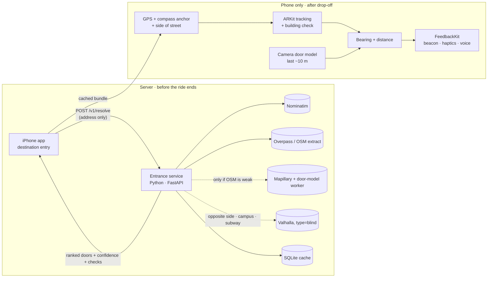
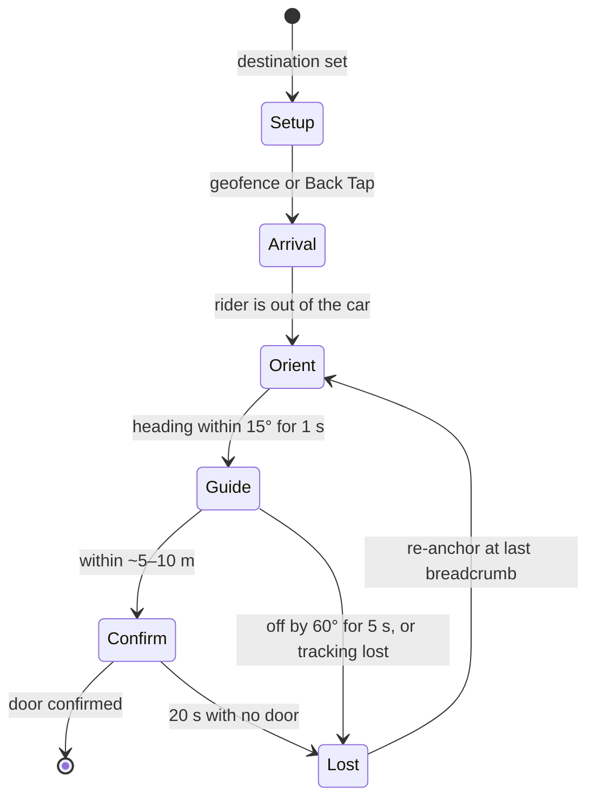

# Car to Curb: Build Plan and Architecture

**Team:** MIT Assistive Tech, Blind Assistance [Software], 2026–27
**Status:** Draft for team review. Every number and threshold here is a proposal until the team and the codesigners sign off.
**Last updated:** 2026-10-04

> **Known issues (architecture review, 2026-10-06). Fixes pending; don't build on these yet:**
> - The street-photo bearing formula in sections 8 and 13 and `server/app/geo.py` is linear. Use the pinhole model `atan((x − cx) / f)` with the field of view from Mapillary's `camera_parameters`. With the correct formula, the worked example's hits are about 1.8 m apart, not 0.4 m.
> - Noisy-OR in `server/app/scoring.py` treats sources as independent, but they often aren't. Use the best independent source plus one step up when they agree.
> - The building-number check works at about 10–25 m, not 50 m. ARKit drifts about 2–3.5 m over 50 m, and the GPS starting point can be 7–14 m sideways at 40 m, so the app must keep re-anchoring.
> - OSM entrance coverage is low: about 10% of MIT/Kendall buildings and 1.8% of Cambridge. Survey the test sites' entrances into OSM.
> - Public Overpass allows about 100 queries and 10 MB a day per deployment. Precompute the pilot area from the Geofabrik extract. Geocode with structured queries; free-form "77 Massachusetts Ave" returns a bus stop.
> - Render's free tier has no disk, so SQLite is wiped on redeploy.
> - The app needs the `location` and `audio` background modes. The Swift has not been compiled yet; build it once on a Mac first.
> - Proposed lower targets: detector precision ≥ 0.90 and recall ≥ 0.80; success ≥ 70% overall and ≥ 85% same-side.

---

## Contents

1. [Problem](#1-problem)
2. [MVP](#2-mvp)
3. [Full user workflow](#3-full-user-workflow)
4. [Architecture overview](#4-architecture-overview)
5. [Sensor handoff](#5-sensor-handoff)
6. [Side-of-street detection](#6-side-of-street-detection)
7. [Camera building check](#7-camera-building-check)
8. [Server: entrance resolution service](#8-server-entrance-resolution-service)
9. [Reading OSM entrance tags](#9-reading-osm-entrance-tags)
10. [API contract](#10-api-contract)
11. [Phone: iOS app](#11-phone-ios-app)
12. [Routing](#12-routing)
13. [Computer vision and ML](#13-computer-vision-and-ml)
14. [Data sources and limits](#14-data-sources-and-limits)
15. [Integrations](#15-integrations)
16. [Security, privacy and safety](#16-security-privacy-and-safety)
17. [Failure handling](#17-failure-handling)
18. [Testing and field trials](#18-testing-and-field-trials)
19. [DevOps and team workflow](#19-devops-and-team-workflow)
20. [Work breakdown](#20-work-breakdown)
21. [Roadmap](#21-roadmap)
22. [Decision records](#22-decision-records)
23. [Open questions](#23-open-questions)
24. [Sources](#24-sources)

---

## 1. Problem

After an Uber, Lyft or Waymo drops off a blind or low-vision rider, existing apps (BlindSquare, VoiceVista, Waymo's "Find my destination") get them to within 30 ft–30 yd of a building's general location, not to the door. The last 10–40 m is still guesswork: which side of the street, which side of the building, which door is the entrance.

**What the codesigners told us:**
- **Dealbreakers:** reliability, speed, convenience ("is an existing tool easier?"), wearables that draw negative attention, short battery life, proprietary chargers.
- **Privacy:** they prefer AI that runs on the phone.
- **Feedback:** people differ, so support haptics, sound, voice and braille input, each switchable, and shareable presets. "Return to a known vector in the shortest period."
- **Test cases:** getting out of an Uber with the entrance on the same side, on the opposite side, near driveways, on a campus, at a hotel, and coming out of the subway.

**End goal:** one app covering Car to Curb (this plan), then Curb to Car, a Bus Stop helper, and Meta glasses integration.

---

## 2. MVP

**One sentence:** an iPhone app that looks up the entrance before the ride ends, guides the rider there after drop-off with a 3D audio beacon, haptics and voice, confirms the building and then the door with the on-phone camera, and always says how confident it is.

**Core value to prove:** a blind rider reaches the correct door on their own, faster and more reliably than with the tools they already use. If that fails, nothing else on the roadmap matters.

### In, by the April freeze
- iOS only, iPhone 12 or newer. LiDAR helps but isn't required.
- Entrance lookup from OSM entrance tags, then the building outline and street-facing side.
- Entrance data cached before arrival, so the walk works offline.
- Side-of-street detection from the car's heading.
- GPS and compass anchor, then ARKit tracking. Breadcrumbs and "return to a known vector" when lost.
- Camera building check from ~50 m (reads the number and signs), then a door check in the last ~10 m.
- Spatial audio beacon, haptics and voice, each with its own switch. 3 voice verbosity levels.
- VoiceOver throughout. Back Tap and Siri entry points.
- Spoken confidence levels and an "I'm not sure" state.
- A local trip log for measuring success rate.

### Only if the data says so
- **Mapillary photos plus server door detection:** only if the October audit finds fewer than 50% of test sites have tagged OSM entrances.
- **Valhalla walking routes** for opposite-side, campus and subway-exit cases (needs team sign-off).

### v2
Curb to Car · obstacle alerts and passive "tell me when you see X" · ARKit GeoTracking where supported · facade photo matching · Apple Watch haptics · AirPods head tracking · shared feedback-profile library · rideshare deep links · crowd-confirmed entrances.

### v3+
Bus Stop helper · Meta Ray-Ban glasses (Wearables Device Access Toolkit is a developer preview) · Android · indoor navigation · street-crossing guidance · the "other ideas" list from the meeting notes.

### Not doing
- ML on Google Street View: Google's terms ban ML on Maps content and caching it.
- Telling users when it is safe to cross a street.

### Success metrics (proposed, to agree with the codesigners in November)

| Metric | Target |
|---|---|
| Reached the correct door, no sighted help, ≤ 3 min | ≥ 80% overall, ≥ 90% same-side |
| App said "entrance" and was wrong | ≤ 2% overall, 0 on the test suite |
| Final position error | ≤ 2–3 m in ≥ 85% of trials |
| Time from Back Tap to hand on the door | median ≤ 1.5× a sighted walker |
| Head-to-head with their current tool | preferred in ≥ 2 of 3 scenario types |
| Battery per guided trip | ≤ 8% per 10 min |
| Recovery after going off course | median ≤ 20 s |

### Test scenarios

| Scenario | What's hard | Pass bar |
|---|---|---|
| Same side of street | Picking the neighbor's door | ≥ 90% |
| Opposite side | Needs a crossing; GPS can't tell which side of a narrow street you're on | ≥ 75% |
| Near driveways | Curb cuts look like walkways; garage doors look like entrances | 0 garage-door errors |
| Campus (MIT) | Address doesn't match the door; many doors, some locked | ≥ 75% |
| Hotels | Drop-off lanes, revolving doors, lobby vs restaurant entrances | ≥ 75% |
| Coming out of the subway | No GPS underground; the rider doesn't know which way they're facing | ≥ 70% |

---

## 3. Full user workflow

Example: a blind rider is going to a meeting at MIT Building 7, 77 Massachusetts Ave.

### 0. First-time setup (once)
- **Rider:** installs the app and opens it with VoiceOver. A spoken tour asks how they want guidance (they pick sound + vibration, short voice), which units (feet), and whether to set up Back Tap (yes).
- **Behind the scenes:** these choices become their `FeedbackProfile`, saved on the phone. There's no account. Location ("while using") and camera permission are each asked for the first time they're needed, with spoken reasons.

### 1. Setting the destination
- **Rider:** books an Uber as usual, then says *"Hey Siri, find the entrance to 77 Mass Ave."*
- **Behind the scenes:** the app sends **only the address** to our server. The server finds Building 7's outline in OpenStreetMap and an `entrance=main` node facing Mass Ave, tagged `automatic_door=button` and `step_count=3`. It scores it 0.90, notes that Mass Ave is two-way and the door is on its east side, and returns the bundle. The phone caches it, so it no longer needs internet.
- **Rider hears:** *"Entrance found for 77 Mass Ave. Main entrance, facing Mass Ave on the east side. It has 3 steps and a push-button door. I'll guide you when you arrive."*

### 2. During the ride
- **Rider:** nothing.
- **Behind the scenes:** low-power GPS. About 3 minutes out, one refresh of the bundle. The phone starts recording the car's direction of travel.
- **Rider hears (optional):** *"About a minute away."*

### 3. The car stops: which side of the street?
- **Behind the scenes:** the car was heading north on Mass Ave. US cars pull over to the right, so the rider is on the east curb. The door is also on the east side, so it's the **same side**. The rider's own GPS may be 10 m off; the car's heading is far more reliable. See [section 6](#6-side-of-street-detection).

### 4. Starting guidance
- **Rider:** double-taps the back of the phone.
- **Rider hears/feels:** a double buzz, then *"Starting. Stand still for a moment."*
- **Behind the scenes:** a GPS fix and compass heading are saved as the starting point, and ARKit starts tracking.

### 5. Facing the right way
- **Rider hears:** *"Your entrance is on this side of the street, about 110 feet ahead and to your right."* A tone plays that sounds like it comes from the door.
- **Rider:** turns until they feel the **lock buzz** and the tone centers.

### 6. Walking and the building check
- **Rider:** walks with their cane, phone held or on a chest mount (camera-first mode).
- **Rider hears:** a centered tone while on course, a tick every ~15 ft, and spoken distances at 60 ft and 30 ft.
- **Building check (~50 m out):** the camera reads "77" over the door. Its bearing points at the expected building, so: *"I can see '77' ahead, slightly right. That's your building, on this side."*
- **Behind the scenes:** ARKit tracks every step and drops a breadcrumb at each sharp turn. Text recognition runs on the same camera frames 2–3 times a second, then stops once the building is confirmed.

### 7. Going off track
- **Rider:** drifts left around a planter.
- **Rider hears:** *"Off route. Turn until the tone centers."*
- **Behind the scenes:** they were more than 60° off for over 5 s, so the beacon points to their **last breadcrumb**, the fastest way back to a known path.

### 8. Getting close
- **Rider hears:** *"Close. Hold the phone up to check the door."* A rising tone plays.
- **Behind the scenes:** the door model loads. No video ever leaves the phone.

### 9. Confirming the door
- **Rider hears/feels:** buzzes speed up as the door centers, then *"Entrance, slightly right, 10 feet. 3 steps up. Push-button opener on the right."*
- **Behind the scenes:** a door appeared in 5 of the last 8 frames, at the map's location. Because map and camera agree, the app may say **"Entrance."**

### 10. Arrival
- **Rider hears/feels:** a long buzz, *"You've arrived,"* then *"Was this the door? Tap once for yes, twice for no."* They tap once.
- **Behind the scenes:** the outcome (reached the door, 1 min 40 s, 1 recovery) is saved on the phone. Sharing it is opt-in.

### The same trip when things go differently

| What happens | What the rider hears |
|---|---|
| The car stops on the other side | *"Your entrance is across the street. Nearest crosswalk is about 100 feet to your left."* Crossing is up to them; the tone picks up again on the far side. |
| No tagged entrance | At setup: *"I don't know exactly where the door is. I'll guide you to the side facing the street, then help you find it with the camera."* Then: *"Sweep slowly, I'll buzz when I see a door."* |
| The camera's door doesn't match the map | *"A door, possibly the entrance, slightly left."* |
| The camera reads "77" on the wrong building | *"I see '77', but it may not be your building."* |
| GPS goes haywire between tall buildings | *"Location uncertain. Following your steps from the drop-off."* |
| One-way street, or the clues disagree | *"I'm not sure which side of the street you're on. Did you get out onto the sidewalk?"* |
| Phone goes in a pocket | The tone keeps playing on GPS and the compass. Vibration and the camera pause. |
| Stop now | A two-finger double-tap (VoiceOver magic tap) or Back Tap silences everything. |

---

## 4. Architecture overview

A small server that knows about buildings, and an iPhone app that knows about the user. They talk once per trip, before the ride ends. The server never learns where the rider actually is, and the walk needs no signal.



| Part | Runs on | Built with | Job |
|---|---|---|---|
| iOS app | Phone | Swift / SwiftUI | Screens, Siri and Back Tap entry |
| NavigationSession | Phone | Swift state machine | Setup → Arrival → Orient → Guide → Confirm → Lost |
| LocationKit + ARGuide | Phone | CoreLocation, ARKit | Positioning, side of street, bearing and distance math |
| DoorVision | Phone | Vision + Core ML | Building check (text) and door detection |
| FeedbackKit | Phone | Core Haptics, AVAudioEngine, speech | Plays events on the rider's chosen channels |
| Entrance service | Server | Python, FastAPI, Shapely, pyproj | Address → ranked doors and path checks |
| Worker | Server | Python + detector | Mapillary photo jobs, only when OSM isn't enough |
| Cache | Server | SQLite | Saved results; Postgres only if needed |

---

## 5. Sensor handoff

Phone GPS is often 5–15 m off next to buildings, which is exactly where doors are, so each sensor hands off to a more precise one.

| Distance to door | Leads | Notes |
|---|---|---|
| Curb → ~50 m | GPS + compass | Starting position and heading, side of street. Works in a pocket with the screen locked. |
| ~50 → 10 m | ARKit + building check | Tracking to within centimeters. In camera-first mode, reads the building number and signs from the same frames. |
| 10 → 0 m | Camera door check | Core ML at 5–10 fps. Confirmed after 5 of 8 frames. |
| 0 m | Door | "Entrance" only when map and camera agree. |

**iOS limits:** ARKit and the camera stop when the screen locks or the app goes to the background, and Core Haptics goes silent in the background. In a pocket, only the GPS-and-audio beacon works.

---

## 6. Side-of-street detection

Before the car stops, the app can only predict, because nobody knows where the driver will pull over. Rider GPS can't decide it either: a street is 10–20 m across and GPS is often 5–15 m off. The car's heading is the stronger clue.

**How it decides:**
1. **Server, ahead of time:** find the street the entrance faces, which isn't always the address street. Save the road's centerline, which side the door is on, and `oneway`.
2. **Phone, as the car stops:** take the last 20–40 m of straight GPS track before speed drops below 2 m/s. That's the car's direction of travel.
3. **Curb side:** US cars pull over to the right, so the curb is on the right of the direction of travel.
4. **Compare:** the sign of `cross(direction, car→door)`. Negative means right, which is the **same side**. Positive means left, which is the **opposite side**. Use the road's own direction, lined up with the car's.
5. **Confirm on the curb:** ARKit tracks the first steps, and the building check confirms the building.

**Worked example** (local meters, x = east, y = north, road along y = 0):
- GPS before the stop: (−40, −6) → (−20, −4) → (0, −5). The car was heading east, so use the road direction (1, 0).
- Door at (30, −15): arrow car→door = (30, −10). `cross = 1·(−10) − 0·30 = −10`, negative, so **same side**. *"Your entrance is on this side, about 30 meters ahead."*
- Door at (30, +15): arrow = (30, 20). `cross = +20`, positive, so **opposite side**. *"Your entrance is across the street. Nearest crosswalk…"*
- Why not rider GPS: the rider is really at y = −6, but GPS could read y = +3, which would wrongly look like the north side.

| Situation | Problem | Handling |
|---|---|---|
| One-way street | The car can pull over on the left | Side unknown. Ask once, or confirm by walking. |
| Turned just before stopping | Heading points the wrong way | Use only the last straight stretch; otherwise side is unknown |
| Double-parked or stopped mid-street | The rider may not be at a curb | Uncertain until the ARKit walk check |
| Corner building | The door faces a different street | Compare against the entrance's street, not the address street |
| Wide avenue with a median | Crossing is harder | Stronger warning, and point to the nearest `footway=crossing` |

Before arrival the app says which street and side the door is on ("faces Mass Ave, east side"), never "your side". Later clues: the rideshare app's drop-off pin (v2), Waymo's setting to avoid opposite-side drop-offs, and Valhalla's `preferred_side`.

---

## 7. Camera building check

From ~50 m out, the camera's job is to confirm "this is your building, and you're on the right side." ARKit already uses the camera here, so reading the same frames costs very little extra.

| Option | Phase | How |
|---|---|---|
| **Read the signs** | MVP | Apple Vision's text recognition, free and on the phone. Reads the street number, building name, store signs and text on doors, matched against `addr:housenumber`, `name` and tenants in the bundle. |
| **ARKit GeoTracking** | Where available | Matches the camera view against Apple's Look Around imagery for position and heading to within a few meters. Supported cities only; whether Boston and Cambridge are covered is **unverified**. |
| **Facade matching** | v2 | Bundle 2–3 Mapillary photos of the destination's front and match live frames against them. Real ML work, so a stretch goal. |

| Concern | Handling |
|---|---|
| Holding the phone up for longer (tiring, draws attention) | Recommend a chest mount; Meta glasses later |
| Battery | Text recognition 2–3 times a second, stopping once the building is confirmed |
| Pocket mode stops working | Profile setting: **camera-first** or **pocket mode** |
| Bystanders in frame | Frames never leave the phone; nothing is stored |
| "77" on the wrong building | Only counts if the text's bearing points at the expected outline |

A building check that agrees with the map raises confidence. One that disagrees triggers "I'm not sure" before the rider reaches the door. **Ask the codesigners** whether they'd hold the phone up from 50 m, and whether a chest mount is acceptable.

---

## 8. Server: entrance resolution service

One FastAPI container and one worker process. SQLite plus Shapely and pyproj. No Redis, Celery or Kubernetes. Results are computed before arrival.

### The lookup ladder (stops at the first good answer)
1. **Geocode** with Nominatim (1 request/s for the whole app, identifying User-Agent). Fallback: the phone sends coordinates from Apple's geocoder.
2. **Find the building:** the OSM outline containing the point, else one matching the house number within 30 m, else the nearest. Include multipolygon members and `building:part` ways.
3. **Read entrance nodes** that are part of the outline (`node(w)`). Use a 5 m distance only as a fallback, with a penalty. Remove excluded values ([section 9](#9-reading-osm-entrance-tags)). An entrance whose `addr:housenumber` matches wins outright. **Stop here if any candidate is ≥ 0.75.**
4. **Mapillary + door model** (async job, only if step 3 is weak). Photos within 50 m that face the building. Cast a ray from each photo's compass angle to the wall and cluster the hits (DBSCAN, 2–3 m). A cluster needs 3+ photos from 2+ angles. Returns `202` while running.
5. **Geometry fallback:** middle of the street-facing side (0.30), then the address point (0.20).

Then merge candidates within ~4 m, apply crowd confirmations, add path checks and side-of-street data, and return the top 5.

### Confidence scores

| Evidence | Score |
|---|---|
| Entrance `addr:housenumber` = destination number | ranked first |
| `routing:entrance=*` or site-relation role `entrance` | 0.95 |
| `entrance=main` | 0.90 |
| 2+ user confirmations · `staircase`/`home` for a residential address · `shop` when it's the destination | 0.85 |
| `entrance=yes` / `entrance` | 0.75 |
| Mapillary, 2+ angles | 0.65 |
| `secondary` | 0.60 |
| Unknown value | 0.50 |
| Mapillary, single photo | 0.45 |
| Street-facing side | 0.30 |
| Address point | 0.20 |
| `service` (last resort, spoken warning) | 0.20 |

**Modifiers:**
- `wheelchair=yes` +0.05, `wheelchair=no` −0.05
- Footway attached to the node +0.05
- `opening_hours` closed now −0.30
- `level` ≠ 0 or `door=overhead` −0.10
- Within 5 m but not on the outline −0.10
- Mapillary photos older than 5 years ×0.8
- Geocode matched the street but not the house number ×0.7

**Combining:** agreeing sources within ~8 m combine as `1 − Π(1 − s)`, capped at 0.95. Nothing is certain until the camera confirms. Several main entrances are tie-broken by walking distance from the drop-off.

### What the rider hears

| Confidence | Spoken |
|---|---|
| Map + camera agree | "Entrance." |
| ≥ 0.75 | "Likely entrance, about 15 meters ahead, slightly left." |
| 0.45–0.75 | "Possible entrance. I'll check with the camera when we're close." |
| < 0.45 | "Door location unknown. Guiding you to the street-facing side." |

### Path checks (in the bundle)
- Does the straight line cross a road (`highway=*`, not a footway)? If so, warn and point to the nearest `footway=crossing`.
- Does it pass through the building? If so, go around the nearest corner.
- Does a footway reach the entrance node? Then use it for the last meters.

### Caching
- Compute when a place is saved, when the destination is set, and again ~3 minutes before arrival.
- Keep OSM results 30 days and CV results 90 days. Crowd-confirmed results don't expire; they're revalidated if the building outline changes.
- **Overpass limits:** see [section 14](#14-data-sources-and-limits). Keep Overpass responses 7 days and precompute the pilot area.

### Finding a door from street photos (ladder step 4)

When OSM has no door, the server locates it from public Mapillary photos, before the trip. Each photo records where the camera stood and which way it pointed. A door found in the photo becomes a direction, and a line from the camera in that direction hits the building wall at the door.

1. **Get photos facing the building:** within 50 m, keeping only those pointing within about ±60° of the wall.
2. **Find doors** in each photo with the door detector.
3. **Turn the pixel into a direction:** `bearing = compass_angle + (x_px / width − 0.5) × field_of_view`.
4. **Draw the line and intersect it with the building outline** (Shapely).
5. **Combine photos:** cluster the hits (DBSCAN, 2–3 m). 2+ angles score 0.65; a single photo scores 0.45.
6. **Convert back to lat/lon** (pyproj).

**Worked example** (local meters, x = east, y = north, front wall along x = 20, field of view 60°, photos 1,000 px wide):

| | Photo A | Photo B |
|---|---|---|
| Camera position | (0, 0) | (10, −30) |
| Compass angle | 90° | 30° |
| Door box center | 700 px | 350 px |
| Offset `(px/1000 − 0.5) × 60°` | +12° | −9° |
| Bearing to door | 102° | 21° |
| Line hits wall at | (20, −4.3) | (20, −3.9) |

The two hits are 0.4 m apart, so they form one candidate at **(20, −4.1)** with score **0.65**.

**Why it can be off by a couple of meters:**
- A compass error of 5° shifts the point about 1.7 m at 20 m.
- Photo position error shifts the whole line, so prefer Mapillary's refined `computed_geometry`.
- An unknown field of view gives the wrong angle for off-center doors.
- In old photos the door may have moved, so photos older than 5 years are down-weighted.
- Garage doors or windows can be mistaken for doors; requiring photos to agree, plus a door-type check, catches this.

**Guiding the rider to it:**
1. The point goes in the bundle as candidate #1, with source "street photos, 2 images, 2023". The rider hears *"Possible entrance found from street photos… I'll check with the camera when we're close."*
2. Side of street, beacon, ARKit, landmarks and the building check work as usual.
3. **Within ~10 m the camera decides.**
   - A door within ±15° means map and camera agree. The phone then guides to the door it *sees*, which removes the 1–2 m photo error.
   - A door elsewhere gets "possibly the entrance".
   - No door switches to scan mode.
4. "Was this the door?" After 2+ confirmations the door scores 0.85, and a team member can add it to OSM from a survey.

### Data model
```
destinations(id, install_key, query_norm UNIQUE, lat, lon, building_id, created_at)
buildings(id, osm_id UNIQUE, polygon_geojson, polygon_hash, street_side_json, fetched_at)
candidates(id, building_id, lat, lon, source, base_conf, provenance_json, model_version, created_at)
feedback(id, candidate_id NULL, building_id, install_key, verdict, lat, lon, accuracy_m, created_at)
jobs(id, building_id, kind, status, attempts, error, created_at, updated_at)
```
Crowd confidence: `(base·4 + confirms) / (4 + confirms + wrongs)`, one vote per install. Entrances are added back to OSM only by hand, by a team member, from a survey.

---

## 9. Reading OSM entrance tags

From the OSM wiki ([Key:entrance](https://wiki.openstreetmap.org/wiki/Key:entrance), Tag:entrance=main, Key:door, Key:automatic_door) and Taginfo counts as of 2026-10-04. There are 5.46M `entrance=*` tags, almost all on nodes.

| Value | Meaning | Uses | Treatment |
|---|---|---|---|
| `yes` | Generic way in or out | 3.03M | 0.75 |
| `main` | Main entrance; a building can have several | 1.02M | **Preferred**, 0.90 |
| `staircase` | Door to a staircase (apartment blocks, often has the address) | 723k | 0.85 for a residential address, else a penalty |
| `home` | Door of a private house or apartment | 292k | 0.85 for a residential address |
| `garage` | Garage door | 164k | **Exclude** |
| `service` | Staff or delivery door | 78k | 0.20, last resort, with a warning |
| `shop` | Direct shop door that isn't the main one | 65k | 0.85 if that shop is the destination, else 0.55 |
| `emergency` | Fire exit | 29k | **Exclude**; never guide here |
| `secondary` | Extra entrance, often only at special times | 27k | 0.60, "side entrance" |
| `exit` | Exit only | 16k | **Exclude** |
| `no` | A door exists but can't be used | 3k | **Exclude** |
| `entrance` | Entry only | 2.5k | 0.75 |

Also exclude `parking`, `loading_dock`, `basement`, and `access`/`foot` set to `private`, `no` or `delivery`. Split combined values (`main;garage`) on `;` and use the best part. Ignore `railway=subway_entrance`, `indoor=door`, `barrier=entrance` and `barrier=gate`.

**Tags to say aloud** (each is on only 0.3–6% of entrances, so every message must work without them):
- `automatic_door`: the wiki says it exists partly to warn blind users. Motion, button and continuous each get their own phrase.
- `door`: hinged, sliding or revolving ("Revolving door; use the side door if there is one").
- `wheelchair` as a stand-in for step-free, and `step_count` ("3 steps at the door").
- `level` ≠ 0 ("this entrance is on level 2").
- `name` and `ref` tell entrances apart. `entrance:ref` has 6 uses worldwide, so ignore it.
- `opening_hours` when it says closed now.

**Rules that change the algorithm:**
- About 33% of entrance nodes carry `addr:housenumber`, the strongest signal.
- Use way membership, not distance.
- `routing:entrance` and `type=site` relations with role `entrance` mark preferred points.
- A footway sharing the entrance node gives a path for the last meters.
- Nominatim returns an `entrances` list for buildings mapped as ways, a cheap cross-check.

```
way(id:BLDG)->.b;
node(w.b)[entrance]["entrance"!~"^(exit|emergency|garage|no|parking|loading_dock)$"]
  ["access"!~"^(private|no|delivery)$"]["foot"!~"^(private|no)$"];
(._; node(w.b)["routing:entrance"];);
out body;
way(bn)[highway~"^(footway|path|pedestrian|steps)$"]; out geom;
// also: building:part ways inside the outline, multipolygon members, rel[type=site] role=entrance
```

**Try it:** the endpoint is `https://overpass-api.de/api/interpreter`, not the homepage. Send an identifying User-Agent with a team contact:
```bash
curl -X POST "https://overpass-api.de/api/interpreter" \
  -H "User-Agent: MIT-AT-CarToCurb/0.1 (team contact email)" \
  --data-urlencode 'data=[out:json][timeout:25];
    way(around:30,42.35934,-71.09316)[building]->.b;
    node(w.b)[entrance];
    out body;'
```
Paste just the query into [overpass-turbo.eu](https://overpass-turbo.eu) to see it on a map.

**Adding entrances to OSM:** only from an on-site survey. Put the node on the building outline, add `door`, `automatic_door`, `wheelchair` and `step_count`, and join it to the sidewalk footway. Write changeset comments like "Add main entrance and door type to Building 7 based on survey". Automated edits are discouraged, so keep every edit manual.

---

## 10. API contract

**Freeze in week 2.** The iOS team builds against a stub JSON file while the server team builds the service. Use a shared JSON Schema plus a contract test.

| Endpoint | Purpose | Responses |
|---|---|---|
| `POST /v1/resolve` | Resolve an address or lat/lon (same input, same result) | `200` result · `202` pending + `retry_after_s` |
| `GET /v1/destinations/{id}` | Fetch a pending result, or fetch one again | `200` · `404` |
| `POST /v1/destinations/{id}/feedback` | "Was this the door?" confirmed / wrong / new (v2, opt-in) | `204` · `409` duplicate |
| `GET /v1/flags` | Kill switch and per-source switches | `200` |
| `GET /v1/health` | Liveness, plus data and model versions | `200` |

Every request carries `X-Install-Key`: a random ID per install, used only for rate limits.

```jsonc
// POST /v1/resolve  { "address": "77 Massachusetts Ave, Cambridge, MA" }
// Example shape only: IDs, coordinates and tags are placeholders, not real data.
{
  "destination_id": "dst_7f3a",
  "building": { "osm_id": "way/12345678", "name": "Building 7", "housenumber": "77",
                "footprint": [[-71.0932, 42.3593], "…"] },
  "candidates": [
    { "id": "c1", "lat": 42.35921, "lon": -71.09298, "confidence": 0.92, "band": "found",
      "label": "Main entrance",
      "speak": { "door": "hinged", "automatic_door": "button", "step_count": 3 },
      "provenance": [{ "source": "osm_tag", "ref": "node/987654", "tags": { "entrance": "main" } }] },
    { "id": "c3", "lat": 42.35918, "lon": -71.09310, "confidence": 0.30, "band": "facade",
      "label": "Street-facing side (approximate)",
      "provenance": [{ "source": "geometry_fallback", "street": "Massachusetts Avenue" }] }
  ],
  "path_checks": { "crosses_road": false, "nearest_crossing": null, "footway_to_entrance": true },
  "street_side": { "entrance_street": "Massachusetts Avenue", "road_way": "way/2233445",
                   "centerline": [[-71.0935, 42.3590], "…"], "door_side_of_road": "east", "oneway": false },
  "recognize": { "text": ["77", "Building 7"] },
  "route": null,
  "attribution": ["© OpenStreetMap contributors", "Mapillary CC-BY-SA"],
  "data_version": { "osm": "2026-10-03", "model": "door-v0.3" }
}
```

`recognize.text` lists the strings the building check should look for. `route` holds the Valhalla walking route, only when needed.

**Errors** all use one envelope: `{ "error": { "code": "...", "message": "...", "request_id": "..." } }`.

| Code | HTTP | Meaning |
|---|---|---|
| `GEOCODE_NOT_FOUND` | 404 | Address not found |
| `UPSTREAM_UNAVAILABLE` | 503 | A map service is down; a cached result is served when there is one |
| `RATE_LIMITED` | 429 | Includes a `Retry-After` header |
| `VALIDATION` | 422 | Bad input |

Upstream timeouts: Overpass 25 s, Mapillary 10 s. Two retries with backoff.

---

## 11. Phone: iOS app

Native Swift / SwiftUI. The app logic never plays sounds or vibrations itself. It emits events, and FeedbackKit plays them on the rider's chosen channels.



### Modules
| Module | Apple frameworks | Job |
|---|---|---|
| App | SwiftUI, App Intents | Five VoiceOver-first screens. Siri, Back Tap, Action Button, Control Center. |
| Session | Observation, Swift Concurrency | The state machine above |
| EntranceAPI | URLSession, Codable, SwiftData | Server client and bundle cache |
| LocationKit | CoreLocation, Core Motion | GPS, heading, geofence, side of street, bearing math |
| ARGuide | ARKit | Anchors GPS in AR space, tracks motion, saves breadcrumbs, GeoTracking where available |
| DoorVision | Vision, Core ML | Building check (text recognition) and door detection, both matched against the map |
| FeedbackKit | Core Haptics, AVAudioEngine HRTF, AVSpeechSynthesizer | Events → channels per profile |
| Telemetry | OSLog | Trip log on the phone only |

```
BlindAssist/
  App/            SwiftUI entry, AppIntents, ControlWidgets
  Features/       DestinationEntry, SavedPlaces, Settings, Session
  Core/           FeedbackKit, LocationKit, ARGuide, DoorVision, EntranceAPI, Telemetry
  WatchApp/       haptics relay (v2)
  Tests/          XCTest + recorded GPS/heading traces
```
Start with no third-party dependencies; add one only with a justified PR.

### Screens
1. Destination entry: search, dictation and braille through a standard text field.
2. Saved places, with a stored door correction when the rider confirms one.
3. Feedback profile and settings: a switch for each channel, intensity, verbosity, camera-first or pocket mode, import and export.
4. Active session: a full-screen "Where am I / Repeat" button and a Stop button.
5. After the trip: "Did you reach the door?"

### FeedbackKit
Events: `direction(offsetDeg)`, `distance(m)`, `onBearingLock`, `warning(kind)`, `buildingConfirmed`, `doorDetected(offset)`, `lost`, `arrival`, `modeChanged`.

| Channel | How | Notes |
|---|---|---|
| Haptics | Core Haptics AHAP patterns: direction tick, lock, distance pulse, arrival, warning | Silent in the background, so Apple Watch is the backup (v2) |
| Spatial beacon | `AVAudioEnvironmentNode` HRTF; listener orientation updated 30–60 times/s | Background audio and location modes keep it working in a pocket |
| Voice | `AVSpeechSynthesizer` with the user's VoiceOver voice | Queued behind VoiceOver; minimal / normal / chatty |
| Earcons | Short sound files | Mixed with the beacon |
| Braille | Braille screen input and displays via VoiceOver on standard text fields | Every input is a real text field or accessibility action |

```swift
struct FeedbackProfile: Codable, Identifiable {
  var id: UUID; var name: String; var version: Int
  var haptics: HapticsConfig      // enabled, intensity, patternSet, useWatch
  var beacon: BeaconConfig        // enabled, sound, volume, distanceCurve
  var voice: VoiceConfig          // verbosity, .clock/.degrees/.leftRight, m/ft/steps
  var earcons: EarconConfig
  var cameraMode: CameraMode      // .cameraFirst / .pocket
  var eventRouting: [FeedbackEvent: Set<Channel>]
}
```
Profiles are shared as `.bafeedback` files. Ship 3–4 presets designed with the codesigners.

**Audio session:** `.playback` / `.spokenAudio`, ducking other audio during speech and mixing with it for the beacon, so music and the Uber app keep playing. Handle interruptions such as phone calls.

### Accessibility checklist
- Every control has a label, a hint and the right trait. The session view has 7 elements or fewer.
- VoiceOver magic tap repeats the last instruction.
- Dynamic Type up to AX5. Bold Text, Increase Contrast and Smart Invert are respected.
- No time limits, no long-press timers, no swipe-only controls.
- Entry points without the screen: App Intents, Back Tap, Action Button, Control Center.
- Audio tested alongside VoiceOver, Music, an active Uber trip and an incoming call.
- Critical events go out on at least 2 channels by default.

### Battery
- Geofence only during the ride.
- Camera: building check from ~50 m in camera-first mode only, 2–3 times a second, stopping once confirmed. Door check 5–10 fps in the last 10 m.
- The camera stops when the phone is pocketed, after a confirmed door, or after 20 s with no door. Models slow down when the phone runs hot.
- Target: ≤ 8% per 10-minute trip.

---

## 12. Routing

| Case | Approach |
|---|---|
| Same-side drop-off (MVP) | Straight-line bearing plus the path checks. A beacon at the door is what the codesigners asked for. |
| Opposite side, campus, subway exit (proposed) | The server asks **Valhalla** for a walking route and caches it in the bundle. The beacon follows its waypoints. |

**Why Valhalla instead of GraphHopper** (from the Valhalla route API reference, read 2026-10-04):

| Pedestrian option | What it does | Our use |
|---|---|---|
| `type: "blind"` | "Announcing crossed streets, the stairs, bridges, tunnels, gates and bollards… information about traffic signals on crosswalks" | Spoken route notes |
| `driveway_factor` | Multiplies the cost of driveways | Driveway scenario |
| `walkway_factor`, `sidewalk_factor` | Change the cost of footways and roads with sidewalks | Prefer real sidewalks |
| `step_penalty` | Seconds added for each move onto steps | Avoid stairs when possible |
| `preferred_side`, `street_side_tolerance` | Approach a location from the same, opposite or either side of the road | Opposite-side case |

Valhalla is open source (MIT license). For hosting, use Stadia Maps' free tier for the pilot, or run our own from the Massachusetts extract. Its docs don't describe building doors as destinations, so pass the entrance node's coordinates as the end point.

---

## 13. Computer vision and ML

Order of trust: OSM tags, then the building outline, then photos plus CV. When unsure, the model abstains.

### Three camera jobs
1. **Building check (phone, ~50 m):** Vision text recognition of the number, name and signs, matched to the bundle by bearing. GeoTracking where available.
2. **Door check (phone, last ~10 m):** ARKit frames go to a Core ML detector on the Neural Engine, under 30 ms per frame, at 5–10 fps. Direction is given as a clock position. Distance comes from LiDAR on Pro phones, then ARKit planes, then Depth Anything V2 Small as a range. Confirmed after 5 of 8 frames, and under 500 ms from the door coming into view to the cue. A door within ±15° of the map's bearing raises confidence; otherwise it's just "a door".
3. **Street photos (server, only if OSM is weak):** Mapillary photos facing the wall, with a large detector on a GPU. The bottom-center of each door box becomes a ray that's intersected with the outline; hits are clustered. Mapillary's docs list no door class, so we run our own detector (task CV-2 checks this).

### Models and licenses
| Need | Pick | License |
|---|---|---|
| Phone detector | RF-DETR Nano/Small, or Create ML as an easy start | Apache-2.0 |
| Server detector | RT-DETR / D-FINE; zero-shot YOLO-World or OWL-ViT for a spike | Apache-2.0 |
| Depth | LiDAR `sceneDepth`, then Depth Anything V2 **Small** | Small is Apache-2.0; Base and Large are non-commercial |
| Segmentation (labeling aid) | SAM 2.1 Tiny, EdgeTAM | Apache-2.0 |
| Text | Apple Vision text recognition | Built into iOS |
| Training data | Open Images V7 "Door", plus ~1,500 of our own labeled campus frames | CC BY. Mapillary Vistas is non-commercial. |
| Benchmark to beat | iOS Magnifier Door Detection (no public API found) | — |

### The YOLO license question (ADR 0007)
Ultralytics YOLO is **AGPL-3.0**. Anything you build with it and give to other people, including over TestFlight, must be released as open source under the AGPL. That covers the whole app, and Ultralytics says it covers trained models too. The AGPL also covers code run over a network. Separately, the GPL family has a known conflict with Apple's App Store terms. Apache-2.0 models (RF-DETR, RT-DETR, D-FINE) can be used in any app, open or closed, as long as you keep the notice.

**Recommendation:** prototype with YOLO if it's easiest, and switch to an Apache-2.0 model before the first TestFlight build. Alternatively, the team deliberately makes the whole repo AGPL. This is not legal advice; ask MIT's Technology Licensing Office if a product or partnership is ever likely.

### Evaluation
- Split data by **location**, never by frame.
- Detection: precision ≥ 0.95, recall ≥ 0.85.
- Entrance localization: median ≤ 3 m, 90th percentile ≤ 6 m.
- End to end: ≥ 90% on the 20-drop-off suite, with 0 confidently wrong doors.
- Below the bar, the feature ships switched off.

### v2: passive watching
A 2–4 fps obstacle detector plus a depth corridor check, with a memory so each object is announced once. A VLM is used only on request, on the phone where possible, and any cloud use is opt-in.

---

## 14. Data sources and limits

| Source | Gives us | Limit / license | Status |
|---|---|---|---|
| Overpass (public) | Buildings, entrance nodes, footways | **~100 queries/day for apps, all users combined.** The wiki's 10k/day guideline is for individuals; apps get 1/100th. Identifying User-Agent required; commercial use must self-host or pay. ODbL attribution. | MVP, behind the cache |
| Geofabrik extract | Massachusetts OSM data to load ourselves | ODbL | When we grow |
| Nominatim | Address → point; `entrances` for buildings mapped as ways | 1 request/s for the whole app, User-Agent required | MVP |
| Apple geocoder / MapKit | Fallback geocoding on the phone | Free; results can't be stored on the server | MVP |
| Mapillary API v4 | Street photos with compass angle | Free, CC-BY-SA 4.0, 50 m search radius, no door class | If the OSM audit is < 50% |
| Valhalla | Pedestrian routes with blind-user notes | MIT license; hosted free tier or self-host | Proposed |
| Apple Look Around (via GeoTracking) | Visual positioning | Supported cities only | Where available |
| Google Street View | Better photo coverage | Paid; terms ban ML on Maps content and caching it | **Not used** |

**Plan:** during the pilot, precompute MIT and Kendall once, keep Overpass responses for 7 days, and send everything through the cache. To grow, load the Massachusetts extract into our own database, or run our own Overpass instance.

---

## 15. Integrations

| Integration | Gives | Phase | Risk |
|---|---|---|---|
| OSM Overpass | Outlines, entrances, footways | MVP | Patchy tags, throttling |
| Nominatim | Geocoding | MVP | Weak US house numbers |
| MapKit / CLGeocoder | Fallback geocoding, place search | MVP | Can't store server-side |
| ARKit world tracking | cm-level motion | MVP | Stops when the screen locks |
| CoreLocation heading | Orientation | MVP | Magnetic interference near cars |
| Core ML + Vision | Door model, text recognition | MVP | Model conversion quirks |
| Siri / App Intents / Back Tap | Start without the screen | MVP | Accidental triggers |
| Soundscape (MIT license) | Beacon design ideas | MVP (ideas) | Large codebase, so read it rather than port it |
| CurbToCar (existing assistive rideshare app) | Feedback design | Research | Ask its developer how it was built |
| Mapillary | Street photos | Conditional | Coverage, no door class |
| Valhalla | Pedestrian routing | Proposed | Hosting |
| ARKit GeoTracking | Visual positioning | Where available | City coverage |
| LiDAR depth | Metric depth | v2 | Pro phones only |
| Depth Anything V2 Small | Monocular depth | v2 | Relative depth only |
| Apple Watch haptics | Discreet taps | v2 | A second app target |
| Uber / Lyft deep links | Trip context | v2 | No drop-off callback |
| Meta Wearables Device Access Toolkit | Glasses camera | v3 | Developer preview |
| Waymo | Drop-off point | v3 | No public API (unverified) |
| Google Street View | Coverage | **Avoid** | Terms |

---

## 16. Security, privacy and safety

The worst failure is telling a blind user to walk somewhere unsafe and sounding sure about it. Safety is treated as a security property.

### Threats
| Threat | Risk | Mitigation |
|---|---|---|
| Wrong or poisoned entrance pin steers the user into a driveway or across a street | **Critical** | Combine sources with a confidence score. Crowd pins need 2+ independent confirmations plus review. Every pin keeps its source and date. |
| Backend logs reveal home addresses and routine trips | High | Buildings only, no user ID, no body logging, truncated IPs, logs deleted after 7 days or less |
| Camera frames leave the phone | High | No network path for frames, verified with a proxy capture test |
| API keys pulled out of the app binary | High | Keys only on the server, which makes those calls for the app. Billing alerts at $5 and $20. |
| Backend abused as a relay, or flooded | Med | Limits per install and per IP, input bounds, App Attest from beta |
| Man in the middle | Med | HTTPS only (ATS defaults) |
| Compromised dependency or weights | Med | Pinned versions, pip-audit, Dependabot, checksums |

### Safety rules
1. Certainty words are banned, enforced by a unit test. Confidence is always spoken.
2. No silent road crossings. The app never says when it is safe to cross.
3. "I'm not sure" is a real state: GPS worse than ~15 m, sources more than ~10 m apart, tracking lost, side of street unknown, or the building check disagrees.
4. Remote kill switch (`/v1/flags`). If the flags can't be fetched, the app uses its most cautious mode.
5. The app supplements the cane or guide dog and never replaces it. No obstacle-avoidance claims in the MVP.
6. One gesture stops guidance immediately.

### Privacy by design
- All CV runs on the phone. No accounts, no advertising ID, no analytics SDKs in the MVP.
- "While using" location only. Saved places are opt-in, excluded from iCloud backup, and can all be deleted.
- Info.plist strings:
  - Location: "Used to find where you were dropped off and guide you to the building entrance. Your location is not stored on our servers."
  - Camera: "Used on your iPhone to look for doors and entrances. Video never leaves your phone."
- App Store privacy label, privacy manifest (`PrivacyInfo.xcprivacy`), Mapillary attribution screen.

### Secrets
- Keys live in host secrets and GitHub Actions environment secrets. Only `.env.example` is committed.
- `gitleaks` runs in pre-commit and CI. GitHub secret scanning and push protection are on.
- If a key leaks: **rotate it first**, then clean history.

### Research ethics
- Ask MIT COUHES (MIT's IRB) **before** structured testing.
- Consent form that works with a screen reader and covers physical risk.
- Recording only with separate opt-in, stored on MIT storage.
- A sighted spotter on every field test.
- Credit codesigners, pay them if the budget allows, and show them results first.

### Checklist by phase
- **MVP:** no keys in the repo; gitleaks; server proxy with rate limits; usage strings; confidence and "not sure" states; no frames over the network.
- **Beta:** COUHES determination; kill switch; spotter protocol; history opt-in and delete-all; 7-day logs; audits passing.
- **TestFlight:** privacy policy, label and manifest; App Attest; billing alerts; attribution; onboarding safety text; leak runbook.

---

## 17. Failure handling

| What fails | What happens |
|---|---|
| Server down at drop-off | Nothing; the bundle is already on the phone |
| No bundle and no signal | Apple geocoder point, "approximate", camera scan mode |
| Overpass or Mapillary down or rate-limited | Serve the cached result even if stale; otherwise `UPSTREAM_UNAVAILABLE` |
| No entrance in OSM | Photos if available, else the street-facing side, said at setup |
| Side of street unknown | Ask once, and confirm with the first steps |
| GPS and ARKit disagree by more than 8 m | Trust ARKit: "Following your steps from the drop-off." |
| ARKit loses tracking | "Take the phone out for a moment," then relocalize from saved anchors |
| Building check disagrees | "I'm not sure" before reaching the door |
| Camera door doesn't match the map | "A door, possibly the entrance." |
| Bad data source | Turned off with `/v1/flags`; most cautious mode if flags can't be fetched |

---

## 18. Testing and field trials

"It works" must point to a logged run. Automated tests never call live map services, and every field failure becomes a replay test.

### Test layers
1. Backend unit and contract tests (pytest against saved Overpass and Mapillary responses, plus a JSON Schema contract).
2. iOS unit tests (XCTest): bearing math, side-of-street cross product, state machine, feedback mapping.
3. Accessibility: XCUITest `performAccessibilityAudit()` on every screen.
4. Location replay: GPX walks recorded at golden sites.
5. Sensor and AR replay: recorded ARKit sessions and labeled frames.
6. Field trials.

### Golden locations (18 sites)

| Scenario | Sites |
|---|---|
| Same side | 3 |
| Opposite side | 3 |
| Driveways | 2 |
| Campus | 3 |
| Hotel | 2 |
| Subway exit | 2 |
| Hard cases (untagged entrance, set-back door, GPS canyon) | 3 |

Also include the same building with drop-offs on both sides and on a one-way street.

**Ground truth:** door coordinates are averaged from ≥ 3 readings on ≥ 2 days, **never copied from OSM**, since OSM is what's being tested. Sites whose readings spread more than 5 m are flagged and left out of pass/fail stats.

### Field trials
- **Phase A:** blindfolded sighted teammates, to find crashes and bad prompts. They are not a stand-in for blind users.
- **Phase B:** the codesigners with their own cane or dog, 4–6 sites in a varied order, plus a baseline run with their current tool.
- **Safety:** one dedicated spotter per participant with stop authority. No unassisted street crossings. Daylight only.
- **Measured:** reached door Y/N, distance error, time, corrections, safety stops, SUS, NASA-TLX, interview notes.

### Go / no-go

| Milestone | Go when all hold | No-go trigger |
|---|---|---|
| M1 Entrance lookup | ≥ 80% of sites within 10 m, ≥ 90% correct side of building, CI green 10 runs in a row | Wrong building returned with high confidence |
| M2 GPS guidance | Audits pass, all replays pass, Phase A ≥ 70% reached, median error ≤ 8 m, 0 crashes | A prompt points into a roadway |
| M3 Camera checks | Door recall ≥ 85%, ≤ 1 false "door" per walk, Phase A ≥ 85% reached, median error ≤ 3 m | Wrong door confirmed at 2+ sites |
| M4 Codesigner trials | ≥ 80% reached, SUS ≥ 70, as fast as or faster than their current tool on half the tasks, battery ≤ 10% per trip | Any safety incident: stop, find the cause, rerun Phase A |

Raise thresholds once they're met; never lower them quietly.

---

## 19. DevOps and team workflow

```
/app/       iOS app (Xcode project, Docs/Instructions.md), see app/README.md
/server/    FastAPI entrance service + tests (Instructions.md), see server/README.md
/contract/  resolve.example.json, the shared API contract both sides build against
/ml/        notebooks, scripts (no raw weights in git)
/docs/      this file, adr/, codesigner-sessions/
/.github/   workflows, CODEOWNERS, PR template
```
- **Branches:** everyone works off `main` with short branches (`name/12-slug`) that merge within a week. One approval plus green CI, squash-merged.
- **PR template:** asks "VoiceOver tested?" and "Does this send data off the phone?"
- **CODEOWNERS:** two reviewers per folder, so reviews don't stall during exams.

**CI (GitHub Actions):**
- `server.yml`: ruff and pytest (runs on `server/**`).
- `app.yml`: simulator build and test (runs on `app/**`). macOS minutes cost about 10× Linux.
- `ml.yml`: nbstripout, ruff, reject files over 10 MB.
- **Make the repo public** for free minutes and push protection. Move iOS builds to Xcode Cloud (25 h/month) once the Apple account exists.

**Distribution:** Apple Developer Program, $99/yr. The University Program ended in May 2024. Education fee waivers require MIT to be the enrolling organization, so ask course staff or IS&T. Codesigners get builds through TestFlight.

**Hosting:**
- Dev: Render's free tier (sleeps after 15 idle minutes).
- Prod: must stay awake during field tests, so ~$7/mo or a ping before sessions.
- Fly.io no longer has a free tier.
- Monitoring: Sentry free plan with location and image data scrubbed, and an uptime check posting to Slack.

**Tooling:**
- GitHub Projects board (Linear's free plan caps at 250 issues).
- Slack `#dev-feed` for bot posts.
- `/docs` is the source of truth; Drive holds meeting notes only.
- Codesigners get email.

**Hardware:** Xcode runs only on a Mac, so survey the team in week 1. LiDAR is on iPhone 12 Pro through 17 Pro only. Ask which phones the codesigners use.

| Budget item | Range |
|---|---|
| Apple Developer | $0–99 |
| 1–2 LiDAR test iPhones | $300–1,520 |
| Prod hosting | $0–60 |
| Loaner Mac | $0–600 |
| **Total** | **~$300–2,300** |

---

## 20. Work breakdown

Every task needed to reach the MVP, grouped by area. Each one says what "done" means.

### App (iOS): `app/`
- **FE-1 Project skeleton.** Create the Xcode project with the module folders from [section 11](#11-phone-ios-app) and one VoiceOver-labeled screen, and get a simulator build passing in CI. Done when `app.yml` is green on `main`.
- **FE-2 LocationKit math.** Write distance, initial bearing, signed relative angle and the side-of-street cross product as pure Swift functions. Done when unit tests cover each, including the worked example in [section 6](#6-side-of-street-detection).
- **FE-3 Heading readout.** A screen that speaks live true heading and its accuracy, and prompts for calibration when accuracy is worse than 20°. Done when it works with VoiceOver only.
- **FE-4 Spatial beacon.** An HRTF tone fixed at a hard-coded coordinate that stays put as the user turns, with the screen locked and headphones on. Done when a blindfolded tester can point at the coordinate within 15°.
- **FE-5 Haptic patterns.** Five AHAP patterns (direction tick, lock, distance pulse, arrival, warning) and a test screen that plays each. Done when the codesigners have tried them and their feedback is recorded.
- **FE-6 Feedback profile.** `FeedbackProfile` with JSON storage and `.bafeedback` import and export. Done when a profile survives export, AirDrop and import.
- **FE-7 Settings screen.** One switch for each channel, plus intensity, verbosity and camera-first or pocket mode, all bound to the profile. Done when it passes a VoiceOver and AX5 Dynamic Type check.
- **FE-8 Audio session.** Ducking and mixing rules plus interruption handling. Done when a manual test passes alongside Music, VoiceOver, an active Uber trip and a phone call.
- **FE-9 Entry points.** App Intents for "Where am I" and "Stop guiding", exposed to Siri and Shortcuts, plus Back Tap setup steps in `app/README.md`. Done when both work from the lock screen.
- **FE-10 Session state machine.** Setup → Arrival → Orient → Guide → Confirm → Lost, driven by a recorded GPS trace. Done when tests replay a full trip and a lost-and-recover trip.
- **FE-11 Entrance client.** URLSession + Codable client for `/v1/resolve`, with the bundle cached on the phone. Done when the app works against the stub JSON with networking off.
- **FE-12 ARKit handoff.** Anchor the GPS fix in the AR session, track relative motion and save breadcrumbs at sharp turns. Done when drift stays under 3 m over a 40 m walk in 8 of 10 tries.
- **FE-13 Side of street at stop.** Detect the stop from speed, take the last straight stretch of track, and compare it with `street_side` from the bundle. Done when it gets the side right on recorded rides on both sides of a two-way street, and returns "unknown" on a one-way street.
- **FE-14 Battery harness.** A script and spreadsheet for a 10-minute guided walk measured with Instruments Energy Log. Done when a baseline number is recorded.

### Server: `server/`
- **BE-1 Service skeleton.** FastAPI app with `/v1/health`, the shared error envelope, install-key middleware, a Dockerfile, and a dev deploy on Render. Done when `/v1/health` responds from the deployed URL.
- **BE-2 Geocoder.** Nominatim adapter throttled to 1 request/s, with an identifying User-Agent and caching. Done when tests pass on 20 Cambridge and Boston addresses using saved responses.
- **BE-3 Overpass client.** The building query from [section 9](#9-reading-osm-entrance-tags), with a 7-day cache, backoff, a configurable mirror URL, and a script that precomputes the pilot area. Done when the pilot area loads from cache with no live calls.
- **BE-4 Entrance scoring.** Read entrance nodes by way membership and score them with the table in [section 8](#8-server-entrance-resolution-service), including exclusions, the address-match override and splitting combined values on `;`. Done when tests pass against 10 MIT buildings with known doors.
- **BE-5 Fallback and street side.** The street-facing side's midpoint, plus the `street_side` block: entrance street, centerline, door side of road, oneway. Done when it's tested on a corner building.
- **BE-6 Resolve endpoints.** `POST /v1/resolve` and `GET /v1/destinations/{id}`, with the SQLite schema as plain SQL migrations. Done when the response validates against the shared JSON Schema.
- **BE-7 Path checks.** Road crossing (with the nearest `footway=crossing`), line through the building, and footway to the entrance. Done when each is tested on a fixture.
- **BE-8 Flags endpoint.** `GET /v1/flags` with a global kill switch and per-source switches. Done when turning off a source changes `/v1/resolve` output.
- **BE-9 OSM coverage audit (October).** For 20 candidate sites, record whether each has a tagged entrance and how far it is from the true door. Done when the percentage is in `docs/`. It decides whether Mapillary is in the MVP.
- **BE-10 Valhalla spike.** Request `type=blind` pedestrian routes for 3 opposite-side and campus sites and compare them with straight lines. Done when the results and a recommendation are in an ADR 0005 draft.

### Computer vision
- **CV-1 License decision.** ADR 0007: AGPL YOLO vs an Apache-2.0 model. Done when the team has agreed and the ADR is merged.
- **CV-2 Mapillary probe.** For 5 campus buildings, list photos within 50 m, their compass angles, and any door-like detections or map features. Done when there's a notebook with a coverage summary.
- **CV-3 Training data.** Download the Open Images "Door" class (plus "Window" as hard negatives) and convert it to the training format. Done when it loads into training.
- **CV-4 Baseline door detector.** Fine-tune a first model and report mAP50, precision and recall on a test set split by location. Done when the numbers are recorded.
- **CV-5 Ray-cast geolocator.** Given a photo's position and angle, a door box and a building outline, return the hit point on the wall. Done when synthetic tests pass.
- **CV-6 Multi-view fusion.** Cluster the hits (DBSCAN) and score candidates. Done when it outputs candidate JSON per building.
- **CV-7 Labeling guide and campus data.** Write the labeling guide, then capture and label about 1,500 frames from campus sites covering the six scenarios. Done when the dataset is versioned.
- **CV-8 Core ML benchmark.** Export the model and measure latency, Neural Engine use and battery per 10 minutes on a LiDAR and a non-LiDAR iPhone. Done when it runs under 30 ms per frame.
- **CV-9 Building-check prototype.** Vision text recognition of numbers and signs, matched to the building by bearing. Done when it's tested at 5 sites, including one with the same number on a nearby sign.
- **CV-10 GeoTracking check.** Find out whether ARKit GeoTracking covers Boston and Cambridge, and test it at 3 sites if it does. Done when the answer is recorded.
- **CV-11 Magnifier benchmark.** Try iOS Magnifier Door Detection at 3 test sites and record where it succeeds and fails. Done when it's written up. It sets the bar to beat.

### Product and research
- **PM-1 Codesigner interviews.** Interview each codesigner separately by Oct 20, and tear down CurbToCar's feedback design. Done when the notes are in `docs/codesigner-sessions/`.
- **PM-2 Hand-guided test.** Before building, have a sighted guide give beacon-style voice cues by hand on a real drop-off. Ask about camera-first mode and a chest mount. Done when the session notes are written up.
- **PM-3 Metrics sign-off.** Agree the success thresholds in [section 2](#2-mvp) with the codesigners in November. Done when they're updated here.
- **ETH-1 Research ethics.** Send the COUHES inquiry, write an accessible consent form, and write the spotter protocol. Done when the determination is on file before Phase B.

### Infrastructure and security
- **OPS-1 Repo setup.** Branch protection on `main`, CODEOWNERS, PR and issue templates, and a Projects board. Done when a test PR needs a review and green CI.
- **OPS-2 Apple account.** Ask MIT about the education fee waiver, enroll (or pay $99), create the App Store Connect app, and invite the codesigners to TestFlight. Done when a codesigner can install a build.
- **OPS-3 Monitoring.** Sentry on the server and app with location and image data scrubbed, plus an uptime check on `/v1/health` posting to Slack. Done when a test error and a test outage both show up.
- **SEC-1 Secret scanning.** gitleaks in pre-commit and CI, GitHub push protection, and `.env.example`. Done when a fake key is blocked.
- **SAFE-1 Confidence wording.** The spoken phrase for each confidence level, plus a test that fails on certainty words. Done when the test runs in CI.
- **PRIV-1 Permissions and privacy.** Info.plist strings, asking for permission at the moment of use, the privacy manifest and a draft App Store privacy label. Done when it's reviewed against [section 16](#16-security-privacy-and-safety).

### Testing
- **QA-1 Golden locations.** The `golden/locations.yaml` schema and collection checklist, then a survey of the first 6 sites (2 same side, 2 opposite, 1 campus, 1 hotel). Done when each site has averaged ground truth.
- **QA-2 Fixture recorder.** A script that saves Overpass and Mapillary responses per golden site, plus pytest scoring of resolver error. Done when it runs in CI.
- **QA-3 Contract test.** A JSON Schema for the API, checked by both the server tests and the app's decoder tests. Done when changing the schema breaks both.
- **QA-4 Replay inputs.** Location, heading and detector protocols with live and replay versions. Done when a recorded walk replays headless.
- **QA-5 Accessibility audit.** An XCUITest target that runs `performAccessibilityAudit()` on every screen. Done when it fails the build on issues.
- **QA-6 Trip logger.** An opt-in log on the phone (GPS, heading, prompts, AR session) that exports to a replay fixture. Done when one real walk has been replayed from its log.
- **QA-7 Trial kit.** Consent script, spotter card, task sheet, SUS and NASA-TLX forms, and a results CSV template. Done when it's reviewed alongside ETH-1.
- **QA-8 Dry run.** A Phase A trial on 3 sites. Done when every issue is filed as a ticket with its log attached.

### Dependencies between areas
| Work | Depends on |
|---|---|
| Entrance client in the app (FE-11) | API contract frozen in week 2 (QA-3) and the stub JSON |
| Spoken confidence | Scoring (BE-4) and wording (SAFE-1) |
| Camera checks in the app | Exported models (CV-8, CV-9) |
| Side of street at stop (FE-13) | `street_side` in the bundle (BE-5) |
| Resolver accuracy numbers | Golden locations (QA-1) and fixtures (QA-2) |
| Codesigner trials | Ethics (ETH-1), trial kit (QA-7) and TestFlight (OPS-2) |

---

## 21. Roadmap

| Month | Milestone | Gate / codesigner touchpoint |
|---|---|---|
| Oct | Discovery: 1:1s, OSM audit, hand-guided test walk; Mac and phone survey; Apple, COUHES and license questions asked | Hand-guided walk with a codesigner |
| Nov | Spikes: beacon to a coordinate, OSM entrance lookup, ARKit drift, side-of-street on recorded rides | Within 3 m in 8 of 10 tries; metrics sign-off |
| Dec | **Alpha (M1 + M2):** steps 1–7 without camera checks; Back Tap, Siri | First same-side trial |
| Jan (IAP) | Camera: building check and door model, Core ML, scan mode; Mapillary only if needed | Door recall ≥ 85% |
| Feb | **Beta (M3):** all 6 scenarios, personal settings, logging, TestFlight | First full scenario run |
| Mar | Harden: fix the 2 worst scenarios, battery, head-to-head against current tools | ≥ 70% overall |
| Apr | **MVP freeze (M4):** second full run, write-up | Primary metric ≥ 80% |
| May | Showcase, retro, v2 scope | v2 priorities |

**Biggest risk: an existing tool is easier.** Test it in October (the hand-guided walk) and in March (head-to-head). If the codesigners don't prefer our app, narrow the project instead of adding features.

---

## 22. Decision records

Each becomes a one-page file in `docs/adr/NNNN-title.md` (context, decision, consequences).

| # | Decision | Why | State |
|---|---|---|---|
| 0001 | Native Swift, not React Native | ARKit, Core ML, haptics, spatial audio and VoiceOver are Apple frameworks; a bridge adds delay to a ~50 ms loop | Proposed |
| 0002 | Camera model runs on the phone | Privacy, works with no signal, low latency | Proposed |
| 0003 | Door lookup on the server, cached | Keys off phones, rate limits, Python strength | Proposed |
| 0004 | OSM + Mapillary, not Street View | Google's terms ban ML on Maps content and caching | Proposed |
| 0005 | Valhalla instead of GraphHopper | Blind mode, driveway and step costs, preferred side | Needs sign-off |
| 0006 | Cache OSM; local extract later | Public Overpass allows apps ~100 queries a day | Proposed |
| 0007 | Door-model license | YOLO is AGPL-3.0; ship Apache-2.0 before TestFlight, or deliberately go AGPL | Team decides |
| 0008 | Spatial audio on AVAudioEngine HRTF | Borrow Soundscape's ideas; don't port its code | Proposed |
| 0009 | Side of street from the car's heading | GPS error is about as large as the street is wide | Proposed |
| 0010 | Camera building check from ~50 m | Confirms the building and side where GPS is weakest; text recognition is cheap | Proposed |

---

## 23. Open questions

**Ask people:**
- Mac survey: who can run Xcode?
- Which iPhones do the codesigners use? Do they have LiDAR?
- Would they hold the phone up from 50 m? Is a chest mount OK?
- MIT Apple fee waiver (course staff or IS&T).
- COUHES: determination or exempt review?
- Each codesigner's own needs, gathered separately.
- Metric thresholds: codesigner sign-off.
- Budget for test phones and codesigner pay.
- CurbToCar: ask its developer how its feedback was built.
- Who is the team contact for the Overpass User-Agent?

**Verify technically:**
- Does Mapillary serve any door detections? (CV-2)
- OSM entrance coverage at our sites (October audit)
- ARKit GeoTracking coverage in Boston and Cambridge (CV-10)
- Overpass set-based `around` syntax
- Soundscape repo license file
- DoorDetect and DoorDet dataset licenses
- Camera field of view for Mapillary photos without camera data
- Render's paid-tier price; whether GitHub Education upgrades the org
- Whether Magnifier Door Detection already solves the last 5 m (CV-11)
- Whether OSM's Organised Editing guidelines apply to a class team
- How entrances on `building:part` ways are mapped in practice

---

## 24. Sources

Read or checked on 2026-10-04 unless noted.

**OpenStreetMap**
- [Key:entrance](https://wiki.openstreetmap.org/wiki/Key:entrance), [Tag:entrance=main](https://wiki.openstreetmap.org/wiki/Tag:entrance%3Dmain), [Key:door](https://wiki.openstreetmap.org/wiki/Key:door), [Key:automatic_door](https://wiki.openstreetmap.org/wiki/Key:automatic_door), [Key:routing:entrance](https://wiki.openstreetmap.org/wiki/Key:routing:entrance), [Good changeset comments](https://wiki.openstreetmap.org/wiki/Good_changeset_comments)
- [Taginfo: entrance values](https://taginfo.openstreetmap.org/keys/entrance#values)
- [Overpass API](https://wiki.openstreetmap.org/wiki/Overpass_API) (endpoint, usage policy) and the [Overpass commons guide](https://dev.overpass-api.de/overpass-doc/en/preface/commons.html)
- [Nominatim usage policy](https://operations.osmfoundation.org/policies/nominatim/)

**Routing and imagery**
- [Valhalla route API reference](https://valhalla.github.io/valhalla/api/route/api-reference/)
- [Mapillary API documentation](https://www.mapillary.com/developer/api-documentation), [Mapillary CC-BY-SA](https://help.mapillary.com/hc/en-us/articles/115001770409-CC-BY-SA-license-for-open-data)
- [Google Maps Platform terms](https://cloud.google.com/maps-platform/terms), [Service-specific terms](https://cloud.google.com/maps-platform/terms/maps-service-terms), [Street View policies](https://developers.google.com/maps/documentation/streetview/policies)

**Models**
- [Ultralytics license](https://www.ultralytics.com/license)
- [RF-DETR](https://github.com/roboflow/rf-detr), [RT-DETR](https://github.com/lyuwenyu/RT-DETR)
- [Depth Anything V2 Core ML](https://huggingface.co/apple/coreml-depth-anything-v2-small) and [its license split](https://github.com/DepthAnything/Depth-Anything-V2/issues/162)
- [SAM 2](https://github.com/facebookresearch/sam2), [EdgeTAM](https://github.com/facebookresearch/EdgeTAM)
- [Open Images V7](https://storage.googleapis.com/openimages/web/factsfigures_v7.html), [DoorDetect](https://github.com/MiguelARD/DoorDetect-Dataset), [DoorDetect-Class](https://github.com/gasparramoa/DoorDetect-Class-Dataset)

**Wearables**
- [Meta Wearables DAT for iOS](https://github.com/facebook/meta-wearables-dat-ios)

**Pricing and infrastructure**
- [GitHub Actions 2026 pricing](https://github.com/resources/insights/2026-pricing-changes-for-github-actions)
- [Apple University Program ended](https://www.macrumors.com/2024/05/16/apple-ends-ios-developer-university-program/)
- [Xcode Cloud hours](https://developer.apple.com/news/?id=ik9z4ll6)
- [Render free tier](https://render.com/articles/platforms-with-a-real-free-tier-for-developers-in-2026)

**Team notes**
- Team meeting notes, Sep 27 and Sep 29, 2026 (internal).
